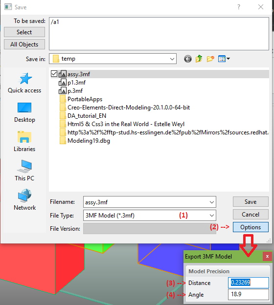

# SAVE_3MF_MODEL [Public Dialog] {.title}

Package: [`3d-printing.data-exchange`](3D-PRINTING.DATA-EXCHANGE.pkg.md) (Nick name(s): `:3dp.x`) {.package}

Save a selection of parts and assemblies as 3mf data file.

<table><tr>
<td>

</td><td>

1. File type selection. Here: 3mf data format is selected.
2. Open the 3mf save options dialog.
3. The linear precision of the exported data: The maximum allowed distance
   of the exported mesh to the CAD model geometry.
4. The angular precision of the exported data: The maximum allowed angular
   deviation of the mesh normals with respect to the CAD model geometry normals.

<td></tr></table>

# Syntax

~~~ bob
                      .-<------------------<----------------------<-.
                     |                                              |
+----------------+   |   .---------------.    .------.              |   +----------+
| SAVE_3MF_MODEL |->-O->-| :3MF_FILENAME |->-/ file /------------->-O->-| COMPLETE |
+----------------+   |   '---------------'  '------'                |   +----------+
                     |   .----------.         .------------------.  |
                     +->-| :OBJECTS |------>-/ parts/assemblies /->-+
                     |   '----------'       '------------------'    |
                     |   .-----------.        .--------.            |
                     +->-| :DISTANCE |----->-/ length /----------->-+
                     |   '-----------'      '--------'              |
                     |   .---------.          .-------.             |
                     '->-| :ANGLE  |------->-/ angle /------------>-'
                         '---------'        '-------'
~~~

# Options

> * `:3MF_FILENAME` - Relative or absolute path to the 3mf file {string}.
> * `:OBJECTS` - Selection of parts and assemblies to export in 3mf format.
> * `:DISTANCE` - Linear precision {number}. Maximum allowed distance of the
>   mesh to the 3d model geometry.
> * `:ANGLE` - Angular precision {number}. Maximum allowed deviation of facet
>   normals with the model geometry normals.
