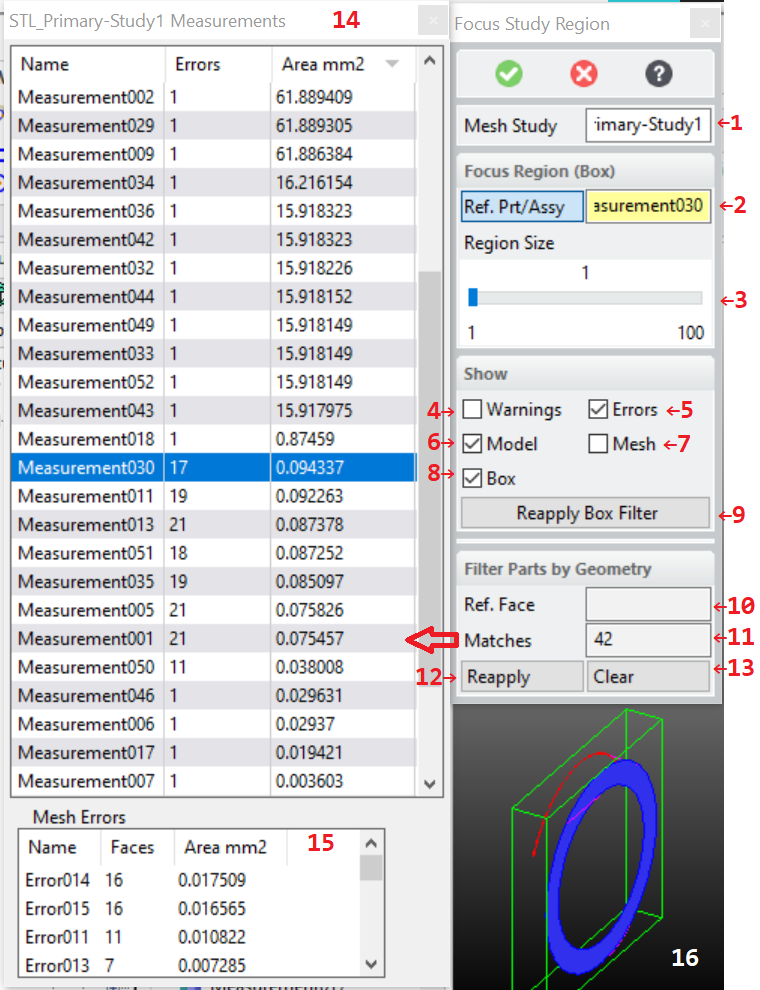

# 3DP_FOCUS_STUDY_REGION [Public Dialog] {.title}

Package: [`3d-printing`](3D-PRINTING.pkg.md) (Nick name(s): `:3dp`) {.package}

Focus on a region of a mesh quality study by showing only items in a
specified _region of interest_ (box) or with related gemoetry.

{.leftfloat}

The dialog offers two complementary approaches for filtering down the measurement to a manageable
size:
* Bounding box based based filter. See options 2-9.
* Filter similar face geometry. See options 10-13.
* Measurement Browser. See options 14,15.

While the dialog is active, both approaches can be used in an alternating way to interactively
switch between box or geometry filtering.

### Dialog Options

1. A mesh study container generated by the dialog [`3DP_MEASURE_MESH_QUALITY`](3DP_MEASURE_MESH_QUALITY.dia.md) ~ Measure the quality of a mesh with respect to the part it was derived from..
   See option `:STUDY` below.

#### Focus Region (Box)

Use part or assembly boxes to focus on a _region of interest_.

2. One or more parts or assemblies from a mesh quality study to define the region of interest for
   the study. The region of interest is created from the bounding box of the selected part(s).
   All parts from the mesh quality analysis which fully lie in the region of interest
   are drawn, all other parts are hidden. See option `:STUDY_PARTS` below.
   Parts not contained in the region of interest are hidded (see **16** for an
   example)
3. The inflation amount for the region of interest. The amount is calculated by increasing the
   bounding box up to the size of the entire measurement result.
   See option `:REGION_SIZE` below.
4. Display filter to show/hide warning facets. See option `:SHOW_WARNINGS` below.
5. Display filter to show/hide error facets. See option `:SHOW_ERRORS` below.
6. Display filter to show/hide error facets. See option `:SHOW_MODEL` below.
7. Display filter to show/hide the mesh. See option `:SHOW_MESH` below.
8. Display filter to show/hide the feeback box of the region of interest.
   See option `:SHOW_BOX` below.
9. Button to re-apply the region-of-interest filter.

#### Filter Parts by Geometry

Use geometric rukes to focus on faces with similar geometriy.

10. A reference model face to be used as a template for finding faces with similar geometries.
    One a face has been selected geometry specific matching options appear.
11. Button to show the number of matching geometries and to open the
    _Measurement Browser_ **(14)** which is described in the next section.
    See option `:GEOMETRY_NUMBER` below.
12. Button to reapply the geometry filter. See `:REAPPLY_RULE` below
13. Button to clear the geometry rule based filter.

#### The Measurement Browser

The measurements browser shows measurements associated with model faces.
Geometry filters as described in the previous section can be used to
reduce the number of measurments shown in this dialog.

14. List of measurements associated with model faces.
    Select individual measurement rows to show error details in the _Mesh Errors_ pane **(15)**
    and focus on that measurement in the graphical display. The _area_ column
    shows the accumulated area of the measurements error facets so that insignificant mesh
    errors (tiny face areas) can be detected quickly.
15. List of mesh error parts of the measurement selected in **(14)**. On selection
    the _region of interest_ is set to the chosen error which is then shown
    in the graphical display.
    The _area_ column
    shows the area of the individual groups of connected error facets
    so that insignificant mesh errors (tiny face areas) can be detected quickly.

# Syntax

~~~ bob
                             .-<--------------------------------------------------------<-.
                             |                                                            |
+------------------------+   |   .--------.    .------.                                   |   +----------+
| 3DP_FOCUS_STUDY_REGION |->-O->-| :STUDY |->-/ part /---------------------------------->-O->-| COMPLETE |
+------------------------+       '--------'  '------'                                     |   +----------+
                             .-<--------------------------------------------------------<-O
                             |   .--------------.        .-------.                        |
                             +->-| :STUDY_PARTS |--->---/ parts /----------------------->-+
                             |   '--------------'      '-------'                          |
                             |   .--------------.        .--------.                       |
                             +->-| :REGION_SIZE |--->---/ length /---------------------->-+
                             |   '--------------'      '--------'                         |
                             |   .----------------.    .----------.                       |
                             +->-| :SHOW_WARNINGS |->-/ :ON/:OFF /---------------------->-+
                             |   '----------------'  '----------'                         |
                             |   .--------------.      .----------.                       |
                             +->-| :SHOW_ERRORS |--->-/ :ON/:OFF /---------------------->-+
                             |   '--------------'    '----------'                         |
                             |   .-------------.       .----------.                       |
                             +->-| :SHOW_MODEL |---->-/ :ON/:OFF /---------------------->-+
                             |   '-------------'     '----------'                         |
                             |   .--------.            .------.                           |
                             +->-| :XFACE |--------->-/ face /->-+---------------------->-+
                             |   '--------'          '------'    |   .----------------.   |
                             |                                   '->-| filter options |->-+
                             |                                       '----------------'   |
                             |   .------------------.                                     |
                             +->-| :GEOMETRY_NUMBER |----------------------------------->-+
                             |   '------------------'                                     |
                             |   .---------------.                                        |
                             +->-| :REAPPLY_RULE |-------------------------------------->-+
                             |   '---------------'                                        |
                             |   .---------------.                                        |
                             '->-| :CLEAR_FILTER |-------------------------------------->-'
                                 '---------------'
~~~

# Options

`:STUDY` {`container`}
:   A study container generated by [`3DP_MEASURE_MESH_QUALITY`](3DP_MEASURE_MESH_QUALITY.dia.md) ~ Measure the quality of a mesh with respect to the part it was derived from..

`:STUDY_PARTS` {`part(assembly) list`}
:   One or more parts or assemblies whose bounding boxes define the region of interest
    to focus on. All selected parts or assemblies must be members of the
    same study.

`:REGION_SIZE` {`number`}
:   Amount of additional inflation of the region of interest up to the size
    of the entire measurement.

`:SHOW_WARNINGS` {`:ON | :OFF`}
:   Show/hide facets which exceed the warning threshold.

`:SHOW_MODEL` {`:ON | :OFF`}
:   Show/hide faces of the CAD model.

`:REAPPLY_BOX`
:   Action to reapply the box filter with the current settings

`:XFACE` {`face`}
:   A reference model face to be used as a template for finding faces with similar geometries.

Geomentric Filter Options
:   Additional, geometry specific matching options to refine the filter.

`:GEOMETRY_NUMBER`
:   Opens the measurements browser.

`:REAPPLY_RULE`
:   Action to reapply the geometry rule filter with the current settings.

`:CLEAR_FILTER`
:   Action to clear the geometry rule filter showing all measurements in the
    measurement browser.

