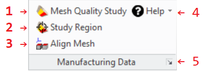

# The Extension Module User Interface {.title}
    
The functionality of this extension module is accessible from the _Modeling_ user interface
in several locations. The most used dialogs of the extension module are accessible via a command group in
the **Extensions** tab of the _Modeling_ ribbon bar.

{.leftfloat}

1. [`3d-printing:3DP_MEASURE_MESH_QUALITY`](3D-PRINTING/3DP_MEASURE_MESH_QUALITY.dia.md) (Measure the quality of a mesh with respect to the part it was derived from)
2. [`3d-printing:3DP_FOCUS_STUDY_REGION`](3D-PRINTING/3DP_FOCUS_STUDY_REGION.dia.md) (Focus on a region of a mesh quality study by showing only items in a specified _region of interest_ (box) or with similar geometry)
3. Align a mesh with the 3-D model it was generated from to prepare for a
   quality analysis.
4. Help actions:
   * Display the doc documentation for the Manufacturing Data
   * Display general module information. See also [`3d-printing:about-module`](3D-PRINTING/about-module.fun.md)
5. [`3d-printing:3DP_SETTINGS`](3D-PRINTING/3DP_SETTINGS.dia.md) (Edit customizable module settings for the 3d printing extension)

Module help and management dialogs are available in following locations:

* _File -&gt; Settings -&gt; Extensions -&gt;_
  **Manufacturing Data Settings ...**: The [`3d-printing:3DP_SETTINGS`](3D-PRINTING/3DP_SETTINGS.dia.md) (Edit customizable module settings for the 3d printing extension)
* _File -&gt;_ **Modules**_: Opens the _Modeling_ module management dialog where the extension module
  can be (de)activated in the CADM Extensions tab by
  (de)selecting _Manufacturing Data_
* In the <b>&#x2754;</b> command group located at the right end of the _Modeling_ ribbon bar where
  the action _Manufacturing Data_ opens the module documentation in the browser.

