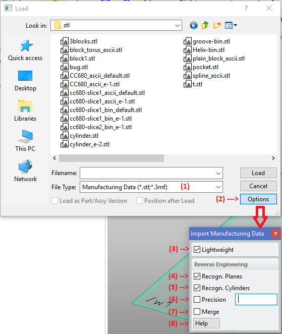
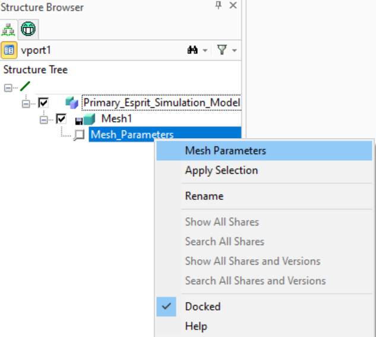

# LOAD_MANUFACTURING_DATA [Public Dialog] {.title}

Package: [`3d-printing.data-exchange`](3D-PRINTING.DATA-EXCHANGE.pkg.md) (Nick name(s): `:3dp.x`) {.package}

_Modeling_ load dialog extension for loading manufacturing data files (STL, 3mf).

Loads a manufacturing data file from disk and creates a 3d model (solid or face part).
A STL or 3mf file can be loaded with or without data reduction. Data reduction is
achieved through reconstruction of analytic surfaces from groups of mesh triangles.
See [Import Examples](../ImportExamples.md) for a comparison of importing with or
without data reduction.

{.leftfloat}

1. File type selection. Here _Manufacturing Data_ load is selected.
2. Open manufacturing data load load options dialog.
3. `:LIGHTWEIGHT` - When checked the STL data is imported as _lightweight_ model
   (graphics with basic measuring capabilities). If unchecked the STL data is imported as
   full (B-rep) model.
4. `:PLANE_RECONSTRUCTION` - When selected, planar regions are
   identified and converted to planar 3d model faces. The default can be customized
   by setting the [`*3DP-PLANE-RECOGNITION-ENABLED*`](../3D-PRINTING/AA3dp-plane-recognition-enabledAA.var.md) option
   in `3dp_customize.lsp`.

   **Note**: This option is enforced if the number of faces in the imported  model would exceed the
   number of faces specified in the configurable parameter [`*3DP-FACE-COUNT-LIMIT*`](../3D-PRINTING/AA3dp-face-count-limitAA.var.md)

5. `CYLINDER_RECONSTRUCTION` - When selected, cylindrical regions are
   identified and converted to cylindrical 3d model faces.
   **Note**: this option is only available when `:PLANE_RECONSTRUCTION` is selected
6. `:RESOLUTION` - Optional approximation precision for surface recognition (in mm).
   This option is available only if at least one recognition optios in selected.
   The default can be customized
   by setting the [`*3DP-DEFAULT-RECOGNITION-PRECISION*`](../3D-PRINTING/AA3dp-default-recognition-precisionAA.var.md) option
   in `3dp_customize.lsp`.
   Typical resolutions fall in the range from 0.1mm(coarse) to 0.000001mm (fine).
   **Note**: this option is only available when `:PLANE_RECONSTRUCTION` is selected.
7. `:MERGE` - Remove mergable edges after data reduction has been applied.
   The default can be customized by setting the [`*3DP-MERGE-ENABLED*`](../3D-PRINTING/AA3dp-merge-enabledAA.var.md)
   option in `3dp_customize.lsp`.
   **Note**: this option is only available when `:PLANE_RECONSTRUCTION` is selected.
8. Display this help page.

# Syntax

~~~ bob
                     .-<-------------------<----------------------<-.
                     |                                              |
+----------------+   |   .----------.                 .------.      |   +----------+
| SAVE_3MF_MODEL |->-O->-| :MF_FILE |-------------->-/ file /----->-O->-| COMPLETE |
+----------------+   |   '----------'               '------'        |   +----------+
                     |   .--------------.             .----------.  |
                     +->-| :LIGHTWEIGHT |---------->-/ :ON/:OFF /->-+
                     |   '--------------'           '----------'    |
                     |   .-----------------------.        .------.  |
                     '->-| :PLANE_RECONSTRUCTION |---+->-/ :OFF /->-+
                         '-----------------------'   |  '------'    |
                                                     |    .-----.   |
                                                     +->-/ :ON /-->-O-<----------------------------------------.
                                                        '-----'     |                                          |
                                                              .-----'                                          |
                                                              |   .--------------------------.    .---------.  |
                                                              +->-| :CYLINDER_RECONSTRUCTION |->-/ :ON/:OFF/->-+
                                                              |   '--------------------------'  '---------'    |
                                                              |   .-------------.                 .-------.    |
                                                              +   | :RESOLUTION |-------------->-/ number/--->-+
                                                              |   '-------------'               '-------'      |
                                                              |   .---------.                     .------.     |
                                                              '->-| :ANGLE  |------------------>-/ angle/---->-'
                                                                  '---------'                   '------'

~~~

# Loading STL Files Without Data Reduction

To load STL files with minimal processing,
set all surface recognition options to `:OFF`. Only minimal repairs are applied. This import
option is primarily for smaller STL models (< 150,000 triangles) if maximum precision is required.
_Modeling_ automatically chooses the optimal model resolution.
Importing STL models with more than 150,000 triangles may cause standard _Modeling_ to
run out of system resources (primaily stack space).

**Note**: To import large models without data reduction a custom build of _Modeling_ is required.

# Loading STL Files With Data Reduction

To load STL models with data reduction, set at least one surface recognition option to `:ON`.
Surface recognition reduces model complexity by a factor from  2-20 depending on the
quality and configuration of the manufacturing data.

See [Import Examples](../ImportExamples.md) for examples of the effect of data reduction.

# Reviewing the Import Options

{.leftfloat}

A report of the import options for each imported part can be generated by clicking on the _Mesh Parameters_
context menu action of the _Mesh Parameters_ associated with the part. The textual report is shown in the _Modeling_
output box.

# Future Enhancements

Following enhancements are planned for future releases:
* Recognition of cones, spheres
* Healing of incomplete models (locally convex holes).
* Custom _Modeling_ build to support larger models without data reduction.
