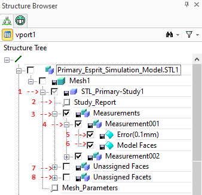

# 3DP_MEASURE_MESH_QUALITY [Public Dialog] {.title}

Package: [`3d-printing`](3D-PRINTING.pkg.md) (Nick name(s): `:3dp`) {.package}

Measure the quality of a mesh with respect to the part it was derived from.

The measurement results are displayed as a simple heat map on the mesh part. Heat map colors can be configured
in the dialog.

**Note** Mesh part and CAD part have to be manually positioned prior to comparison e.g. by using the one
or more part positioning commands provided on the _Structure_ tab by:

* Right clicking the mesh part in the structure browser aand the selecting the _Align Mesh_ command.
* Selecting the _Extensions_ tab in the _Modeling_ ribbon bar and selecting the _Align Mesh_ action
  in the _Manufacturing Data_ command group.

{.leftfloat}

1. The CAD part which was used to generate the mesh part.
   See the dialog option `:MODEL`.
2. The mesh part wich was generated from the CAD part.
   See the dialog option `:MESH_PART`.
3. The distance between facets of the mesh part to the corrsponding
   faces of the CAD part which triggers a quality warning.
   See the dialog option `:WARNING_TOLERANCE`.
4. The distance between facets of the mesh part to the corrsponding
   faces of the CAD part which triggers a quality error.
   See the dialog option `:ERROR_TOLERANCE`
5. The color to set on the facets whose distance to the CAD part
   exceed the warning threshold.
   See the dialog option `:WARNING_COLOR`.
6. The color to set on the facets whose distance to the CAD part
   exceed the error threshold.
   See the dialog option `:ERROR_COLOR`
7. The color to set on the facets which could not be associated with any face of the CAD part.
   See the dialog option `:UNASSIGNED_COLOR`
8. The color for marking CAD model faces which have associated facets with error or warning distances measured.
   See the dialog option `:MODEL_FACE_COLOR`
9. The color for marking CAD model faces which have no associated facets.
   See the dialog option `:UNASSIGNED_FACE_COLOR`

{.rightfloat}

The analysis generates a _quality study_ which is represented as a container (**1**)
below the mesh geometry part.
The container is named after the CAD model which was used for comparison. To make it easier to detect
approximation errors of the mesh with respect to the CAD model following adjustments are made:

* The CAD Model is hidden (removed from the drawing list)
* The mesh part is set to semi-transparent.

The Study container is populated with at most with 3 assemblies (depending on the issues detected):

* The _Measurements_ assembly (**3**) contains measurement details in indexed sub-assembies (**4**)
  for each CAD model face. Each of these sub-assemblies  (**4**) contains up to 3 face parts.
  1. A face part containing mesh facets exceeding the error threshold (**5**), if applicable. The color of this part
     is determined by the `:ERROR_COLOR`.
  2. A face part containing mesh facets exceeding the warning threshold, if applicable. The color of this part
     is determined by the `:WARNING_COLOR`.
  3. A face part containg a single model face (**6**) for which error or warning facets where detected.
     The color of this part is determined by the `:MODEL_FACE_COLOR`.
* The _Unassigned Faces_ assembly (**7**) containing model faces parts each of which represents a group of connected
  faces which could not be assigned to any facet. All parts in this assembly are colored with the
  `:UNASSIGNED_FACE_COLOR`.
* The _Unassigned Facets_ assembly (**8**) containing face parts each of which represents a group of connected
  facets which could not be assigned to any face. All parts in this assembly are colored with the
  `:UNASSIGNED_COLOR`.

To view a textual report of study parameters and results, right-click on the _Study Report_
feature (**2**) and select the _Show Study Report_.

## Quality Study Evaluation

{.leftfloat}

The fastest way to assess the approximation quality to show only the Mesh (displayed as _Mesh1_ in the
Structure Browser), and the _Mesh Study Container_ (displayed as _STL_Primary-Study1_
in the Structure Browser).

To focus on individial regions of the part use the [`3DP_FOCUS_STUDY_REGION`](3DP_FOCUS_STUDY_REGION.dia.md).

# Syntax

~~~ bob
                               .-<-----------------------------------------<-.
                               |                                             |
+--------------------------+   |   .--------.                    .------.    |   +----------+
| 3DP_MEASURE_MESH_QUALITY |->-O->-| :MODEL |----------------->-/ part /--->-O->-| COMPLETE |
+--------------------------+   |   '--------'                  '------'      |   +----------+
                               |   .------------.                .------.    |
                               +->-| :MESH_PART |------------->-/ part /->---+
                               |   '------------'              '------'      |
                               |   .--------------------.        .--------.  |
                               +->-| :WARNING_TOLERANCE |----->-/ number /->-+
                               |   '--------------------'      '--------'    |
                               |   .------------------.          .--------.  |
                               +->-| :ERROR_TOLERANCE |------->-/ number /->-+
                               |   '------------------'        '--------'    |
                               |   .---------------.             .-----.     |
                               +->-| :WARNING_COLOR|---------->-/ rgb /---->-+
                               |   '---------------'           '-----'       |
                               |   .--------------.              .-----.     |
                               +->-| :ERROR_COLOR |----------->-/ rgb /--->--+
                               |   '--------------'            '-----'       |
                               |   .-------------------.         .-----.     |
                               +->-| :UNASSIGNED_COLOR |------>-/ rgb /---->-+
                               |   '-------------------'       '-----'       |
                               |   .-------------------.         .-----.     |
                               +->-| :MODEL_FACE_COLOR |------>-/ rgb /---->-+
                               |   '-------------------'       '-----'       |
                               |   .------------------------.    .-----.     |
                               '->-| :UNASSIGNED_FACE_COLOR |->-/ rgb /---->-'
                                   '------------------------'  '-----'
~~~

# Options

`:MODEL` {`string` | `SEL_ITEM`}
:   Either a path name or a part handle for the CAD part from which the
    mesh was derived.

`:MESH_PART` {`string` | `SEL_ITEM`}
:   Either a path name or a part handle for the mesh part which represents
    a facetted version of the CAD part.

`:WARNING_TOLERANCE` {`number`}
:   The facet-to-model distance threshold beyond which facets are marked
    with the warning color.

`:WARNING_COLOR` {`integer`}
:   The RGB warning color for marking facets.

`:ERROR_TOLERANCE` {`number`}
:   The facet-to-model distance threshold beyond which facets are marked
    with the error color.

`:ERROR_COLOR` {`integer`}
:   The RGB error color for marking facets.

`:MODEL_FACES_COLOR` {`integer`}
:   The RGB error color for marking CAD model faces not assigned to any facet..

