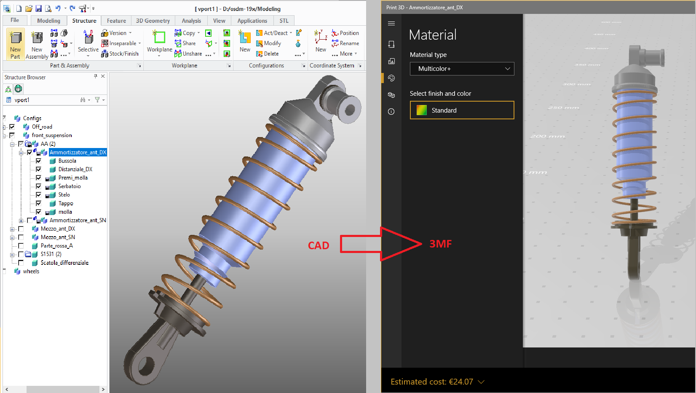
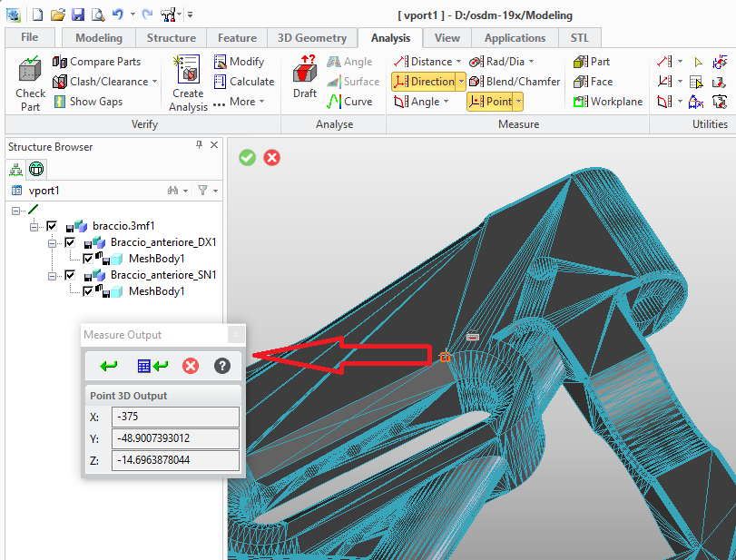

# Modeling Extension Module '3d_printing' {.title}

# 3D Printing Extension Data Sheet

The `3d_printing` extension module for _Modeling_ provides tools for the
3-D printing process chain. It adds utilities and dialogs
to import, export and work with manufacturing data in the industry standard
formats _STL_ and _3MF_.

# Feature Overview

## Manufacturing Data Export {.unfloat}
>
> {.rightfloat}
> 3D CAD Models can be exported in popular manufacturing data formats STL and 3MF:
> * Manufacturing data can be generated from CAD models with full control of linear and angular precision
>   of the triangular mesh.
> * 3MF data export supports:
>   - Assembly structures and part positioning
>   - Geometry sharing (Shared parts)
>   - Part colors
>   - Custom metadata

##  Manufacturing Data Import {.unfloat}
>
>   {.rightfloat}
>   _STL_ and _3MF_ data can be imported to Modeling as:
>   *  Lightweight graphical model supporting geometry inspection
>   * 3D CAD model supporting modeling operation (depending on the data quality)
>   * 3MF data import supports:
>     - Metadata
>     - Component Structure (represented as assembly structure)
>     - Shared Components (represented as shared parts)
>     - Color

## Reverse Engineering of Analytic Surfaces {.unfloat}
>
> {.rightfloat}
>
> * Higher level surface regions are reconstructed from the triangular facet model with
>   automatic or manual precision control.
> * Based on supervised machine-learning algorithms.
> * Significant data reduction
> * Model and surface manipulation (depending on the data quality)

## Mesh Quality Assessment {.unfloat}
>
> {.rightfloat}
> Compare manufacturing models (STL or 3mf) with their original CAD models
> to detect quality issues introduced during mesh postprocessing.

# Getting Started {.unfloat}

* [Extension Module Installation and Startup](Installation.md)
* [Extension Module Customization Overview](Customization.md)
* [The Extension Module User Interface](UI.md)
* [Known Limitations](Limitations.md)
* [Import Examples](ImportExamples.md)
* [Package Release Notes](ReleaseNotes.md)

# Programming Interfaces

## Lisp packages in this module

| Name | Summary |
| :---- | :---- |
| [`3d-printing`](3D-PRINTING/3D-PRINTING.pkg.md) | Primary package of the `3d_printing` extension module for _Modeling_. |
| [`3d-printing.data-exchange`](3D-PRINTING.DATA-EXCHANGE/3D-PRINTING.DATA-EXCHANGE.pkg.md) | The package `:3D-PRINTING.DATA-EXCHANGE` (nicknamed `:3DP.X`) contains a LISP API and dialogs to import or export manufacturing data such as _STL_ or _3MF_ with optional reverse-engineering of facet-data into analytical surfaces. |
