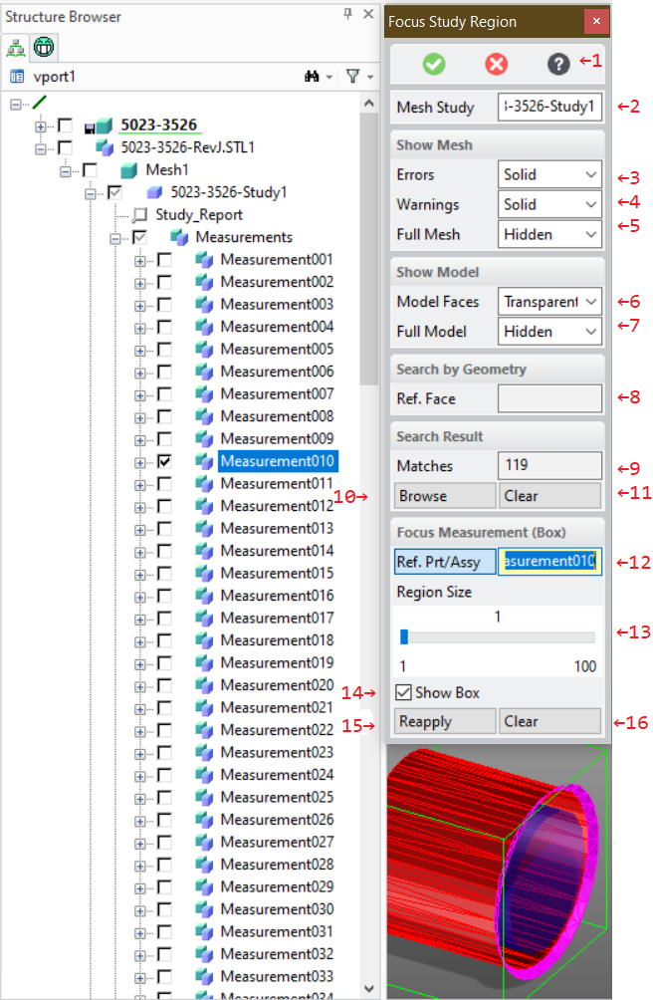
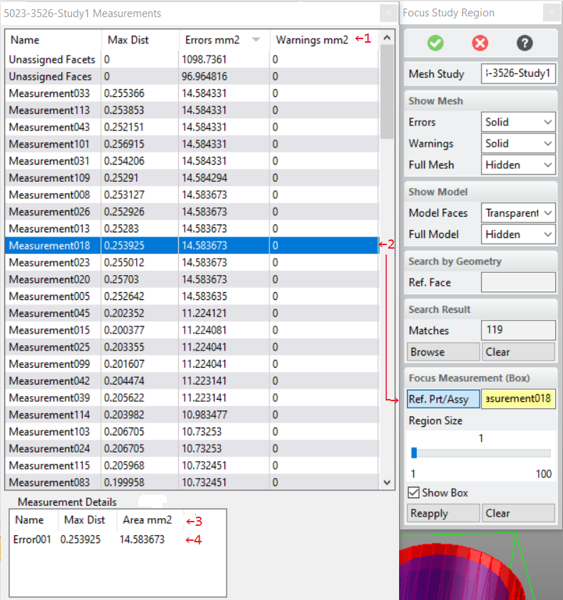

# 3DP_FOCUS_STUDY_REGION [Public Dialog] {.title}

Package: [`3d-printing`](3D-PRINTING.pkg.md) (Nick name(s): `:3dp`) {.package}

Focus on a region of a mesh quality study by showing only items in a
specified _region of interest_ (box) or with similar geometry.

The dialog offers two complementary approaches for filtering down the measurement to a manageable
size:
* Bounding box based based filter. See options 2-9.
* Filter similar face geometry. See options 10-13.

While the dialog is active, both approaches can be used in an alternating way to interactively
switch between box or geometric filtering.

It might be handy to also load the original CAD model for reference, but it is not required.
The study contains a copy of all relevant faces from the CAD model.

# Dialog Options

{.rightfloat}

1. Show this help page.
2. A mesh study container generated by the dialog [`3DP_MEASURE_MESH_QUALITY`](3DP_MEASURE_MESH_QUALITY.dia.md) (Measure the quality of a mesh with respect to the part it was derived from).
   See command line option `:STUDY` below.

Show Mesh Options
:   Selectively show/hide mesh regions from the study. Available choices are:
    * _Solid_: The faces of mesh regions are opaque
    * _Transparent_: The mesh regions are semi-transparent
    * _Hidden_: The mesh regions are hidden.
    &nbsp;
    Following kinds of mesh regions can be controlled with these options:
    3. Error regions. Mesh regions exceeding the error tolerance.
    4. Warning regions. Mesh regions exceeding the warning tolerance.
    5. The entire imported mesh body (full mesh).

Show Model Options
:   Selectively show/hide CAD model regions from the study. Available choices are:
    * _Solid_: Faces of the CAD model opaque
    * _Transparent_: Faces of the CAD model are semi-transparent
    * _Hidden_: Faces of the CAD model are hidden.
    &nbsp;
    Following kinds of CAD model regions can be controlled with these options:
    6. Model Faces. CAD model faces which could not be assigned to mesh faces
       or the measurment found errors/warnings for associates mesh regions.
    7. The CAD model uses as a reference for the mesh evaluation. This
       option is available only if the CAD model is available in session.
       The CAD model is not required to be in session as copies of relevant
       faces are part of the study. However, it might be handy for better
       context visualization.

Search by Geometry Options
:   Use geometric rules to focus on faces with similar geometry.
    &nbsp;
    8. A reference model face to be used as a template for finding faces with similar geometries.
        Once a face has been selected additional geometry specific matching options appear.

Search Result Options
:   9. Show the number of matching geometries.
       See command line option `:GEOMETRY_NUMBER` below.
    10. Open the _Measurement Browser_ (see section
        [Measurement Browser](#the-measurement-browser) for details).
    11. Reapply the geometry filter. See command line option `:REAPPLY_RULE` below

Focus Measurement (By Box)
:   Use part or assembly boxes to focus on a _region of interest_.
    &nbsp;
    12. One or more parts or assemblies from the _study_ the mesh
       quality study container associated with a mesh.
       The bounding box of the selected parts / assemblies define the region of interest
       to focus on. You can use the structure browser for selection, pick, or use the
       measurement browser (recommended). See the [Measurement Browser](#the-measurement-browser) section
       for more details. All parts from the mesh quality analysis which fully lie in the region of interest
       are drawn, all other parts are hidden. See option `:FOCUS_OBJECTS` below.
       Parts not contained in the region of interest are hidded (see illustration item **14** for an
       example).
   13. The inflation amount for the region of interest. The amount is calculated by increasing the
       bounding box up to the size of the entire measurement result.
       This is used to add more context to the focus region.
       See command line option `:REGION_SIZE` below.
   14. Show/hide the region-of-interest (box feedback).
   15. Reapply the region-of-interest (box) filter.
   16. Clear region-of-interest filter.

## The Measurement Browser {.unfloat}

{.rightfloat}

The measurements browser is activated by pressing the _Browse_ button_
(see previous section). It shows measurement errors and warnings associated
with model faces or unidentified geometries. Geometry filters described previous section,
can be used to reduce the number of measurments shown in this dialog.

1. List of measurements associated with model faces.
   A measurement contains a CAD model face, contiguous regions of facets
   exceeding the warning or error tolerance. If an association between
   facets and CAD model faces could not be established, these faces or
   facets are listed as _Unassigned Facets_ or _Unassigned Faces_.

   The _Errors_ and _Warnigs_ columns
   show the accumulated area of the facet regions related to a model face.
   Facet regions with tiny areas are most likely insignificant and can be detected quickly.

   The _Max Dist_ column shows the maximum distance of a mesh group to the
   associated model face. For unassigned facets or faces that distance is
   0 (unknown)

   Left Click on a table column header changes the sort order of that column.
   Right click on a table column header opens the _Column Filter_ dialog. The
   _Column Filter_ dialog can be used to reduce table content based on user
   defined filter criteria.
2. Selecting a measurement automatically defines a region-of-interest (box)
   filter.
3. List of face or facet regions in the measurement selected in **(2)**.
   Left Click on a table column header changes the sort order of that column.
   Right click on a table column header opens the _Column Filter_ dialog. The
   _Column Filter_ dialog can be used to reduce table content based on user
   defined filter criteria.
4. On selection the _region of interest_ (box) filter is set to the chosen
   face or facet group.

   The _Area_ column
   shows the accumulated area of a face or facet region.
   Elments with tiny areas are most likely insignificant
   and can be detected quickly.

   The _Max Dist_ column shows the maximum distance of a face or facet group
   to the associated model face. For unassigned facets or faces
   that distance is 0 (unknown).

# Syntax {.unfloat}

~~~ bob
                             .-<----------------------------------------------------------<-.
                             |                                                              |
+------------------------+   |   .--------.    .------.                                     |   +----------+
| 3DP_FOCUS_STUDY_REGION |->-O->-| :STUDY |->-/ part /------------------------------------>-O->-| COMPLETE |
+------------------------+       '--------'  '------'                                       |   +----------+
                             .-<----------------------------------------------------------<-O
                             |   .--------------.           .--------.                      |
                             +->-| :SHOW_ERRORS |----->----/ option /--------------------->-+
                             |   '--------------'         '--------'                        |
                             |   .----------------.         .--------.                      |
                             +->-| :SHOW_WARNINGS |--->----/ option /--------------------->-+
                             |   '----------------'       '--------'                        |
                             |   .------------.             .--------.                      |
                             +->-| :SHOW_MESH |------->----/ option /--------------------->-+
                             |   '------------'           '--------'                        |
                             |                                                              |
                             |   .------------.             .--------.                      |
                             +->-| :SHOW_FACES |------>----/ option /--------------------->-+
                             |   '------------'           '--------'                        |
                             |   .------------------.       .--------.                      |
                             +->-| :SHOW_FULL_MODEL |->----/ option /--------------------->-+
                             |   '------------------'     '--------'                        |
                             |                                                              |
                             |   .--------.              .------.                           |
                             +->-| :XFACE |----------->-/ face /->-+---------------------->-+
                             |   '--------'            '------'    |   .----------------.   |
                             |                                     '->-| filter options |->-+
                             |                                         '----------------'   |
                             |   .------------------.                                       |
                             +->-| :GEOMETRY_NUMBER |------------------------------------->-+
                             |   '------------------'                                       |
                             |   .----------------.                                         |
                             +->-| :BROWSE_RESULT |--------------------------------------->-+
                             |   '----------------'                                         |
                             |   .-------------------.                                      |
                             +->-| :CLEAR_GEO_FILTER |------------------------------------>-+
                             |   '-------------------'                                      |
                             |   .----------------.        .-------.                        |
                             +->-| :FOCUS_OBJECTS |--->---/ parts /----------------------->-+
                             |   '----------------'      '-------'                          |
                             |   .--------------.          .--------.                       |
                             +->-| :REGION_SIZE |----->---/ length /---------------------->-+
                             |   '--------------'        '--------'                         |
                             |   .-----------.           .---------.                        |
                             +->-| :SHOW_BOX |----------/ :ON/OFF /----------------------->-+
                             |   '-----------'         '---------'                          |
                             |   .--------------.                                           |
                             +->-| :REAPPLY_BOX |----------------------------------------->-+
                             |   '--------------'                                           |
                             |   .------------.                                             |
                             '->-| :CLEAR_BOX |------------------------------------------->-'
                                 '------------'
~~~

# Command Line Options

`:STUDY` {`container`}
:   A study container generated by [`3DP_MEASURE_MESH_QUALITY`](3DP_MEASURE_MESH_QUALITY.dia.md) (Measure the quality of a mesh with respect to the part it was derived from).

## _Show Mesh_ Panel

`:SHOW_ERRORS` {`keyword`}
:   Show mesh regions whose maximum distance to the CAD model face exceed
    the error tolerance of the study in one of the following modes:
    * `:solid` - show regions opaque
    * `:transparent` - show regions semi-transparent.
    * `:hidden' - regions are hidden

`:SHOW_WARNINGS` {`keyword`}
:   Show mesh regions whose maximum distance to the CAD model face exceed
    the warning tolerance of the study in one of the following modes:
    * `:solid` - show regions opaque
    * `:transparent` - show regions semi-transparent.
    * `:hidden' - regions are hidden

`:SHOW_MESH` {`keyword`}
:   Show the entire mesh which the study is based upon in
    one of the following modes:
    * `:solid` - show mesh opaque
    * `:transparent` - show mesh semi-transparent.
    * `:hidden' - hide mesh

## _Show Model_ Panel

`:SHOW_FACES` {`keyword`}
:   Show model faces of the CAD model in one of the following modes:
    * `:solid` - show regions opaque
    * `:transparent` - show regions semi-transparent.
    * `:hidden' - regions are hidden

`:SHOW_FULL_MODEL` {`keyword`}
:   Show the entire CAD model which the study is based upon in
    one of the following modes:
    * `:solid` - show mesh opaque
    * `:transparent` - show mesh semi-transparent.
    * `:hidden' - hide mesh

    This opton is only available if the CAD model is loaded into session. The
    CAD model is not part of the study and must be loaded explicitely.

## _Search By Geometry_ Panel

`:XFACE` {`face`}
:   A reference model face to be used as a template for finding faces with similar geometries.
    Upon selection populates the dialog with additional, geometry specific
    matching options.

 ## _Search Result_ Panel

`:GEOMETRY_NUMBER` {}
:   Shows the number of matching geometries. This field is
    read-only.

`:BROWSE_RESULT`
:  Open the _Measurement Browser_

`:CLEAR_GEO_FILTER`
:   Action to clear the geometry rule filter showing all measurements in the
    measurement browser.

## _Focus Measurement (By Box)_ Panel

`:FOCUS_OBJECTS` {`part(assembly) list`}
:   One or more parts or assemblies whose bounding boxes define the region of interest
    to focus on. All selected parts or assemblies must be members of the
    same study.

`:REGION_SIZE` {`number`}
:   Amount of additional inflation of the region of interest up to the size
    of the entire measurement. Used to add more context.

`:SHOW_BOX` {`:ON | :OFF`}
: Show or hide the feedback box of the region-of-interest.

`:REAPPLY_BOX`
:   reapply the box filter with selected parts/assemblies.

`CLEAR_BOX`
:   Remove the region-of-interest filter.

