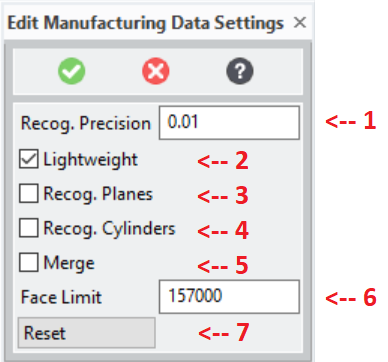

# 3DP_SETTINGS [Public Dialog] {.title}

Package: [`3d-printing`](3D-PRINTING.pkg.md) (Nick name(s): `:3dp`) {.package}

Edit customizable module settings for the 3d printing extension.

{.leftfloat}

1. Configures the [`*3dp-default-recognition-precision*`](AA3dp-default-recognition-precisionAA.var.md) parameter.
2. Configures the [`*3dp-lightweight-model-enabled*`](AA3dp-lightweight-model-enabledAA.var.md) parameter.
3. Configures the [`*3dp-plane-recognition-enabled*`](AA3dp-plane-recognition-enabledAA.var.md) parameter.
4. Configures the [`*3dp-cylinder-recognition-enabled*`](AA3dp-cylinder-recognition-enabledAA.var.md) parameter.
5. Configures the [`*3dp-merge-enabled*`](AA3dp-merge-enabledAA.var.md) parameter.
6. Configures the [`*3dp-face-count-limit*`](AA3dp-face-count-limitAA.var.md) parameter.
7. Resets all parameters to the startup customization in `3dp_customize`.

# Syntax

~~~ bob
                   .-<---------------------------------------------<-.
                   |                                                 |
+--------------+   |   .------------------------.    .--------.      |   +----------+
| 3DP_SETTINGS |->-O->-| :RECOGNITION-PRECISION |->-/ number /----->-O->-| COMPLETE |
+--------------+   |   '------------------------'  '--------'        |   +----------+
                   |   .--------------.              .----------.    |
                   +->-| :LIGHTWEIGHT |----------->-/ :ON/:OFF /--->-+
                   |   '--------------'            '----------'      |
                   |   .--------------.              .----------.    |
                   +->-| :PLANE_RECOG |----------->-/ :ON/:OFF /--->-+
                   |   '--------------'            '----------'      |
                   |   .--------------.              .----------.    |
                   +->-| :PLANE_RECOG |----------->-/ :ON/:OFF /--->-+
                   |   '--------------'            '----------'      |
                   |   .-----------------.          .----------.     |
                   +->-| :CYLINDER_RECOG |------->-/ :ON/:OFF /---->-+
                   |   '-----------------'        '----------'       |
                   |   .--------.                   .----------.     |
                   +->-| :MERGE |---------------->-/ :ON/:OFF /---->-+
                   |   '--------'                 '----------'       |
                   |   .-------------.              .---------.      |
                   +->-| :FACE_LIMIT |----------->-/ integer /----->-+
                   |   '-------------'            '---------'        |
                   |   .--------.                                    |
                   '->-| :RESET |---------------------------------->-'
                       '--------'
~~~

# Options

`:RECOGNITION_PRECISION` {`number`}
:   The surface recognition setting: [`*3dp-default-recognition-precision*`](AA3dp-default-recognition-precisionAA.var.md)

`:LIGHTWEIGHT` {`boolean`}
:   Lightweight model switch:  [`*3dp-lightweight-model-enabled*`](AA3dp-lightweight-model-enabledAA.var.md)

`:PLANE_RECOG` {`boolean`}
:   Plane recognition switch: [`*3dp-plane-recognition-enabled*`](AA3dp-plane-recognition-enabledAA.var.md)

`:CYLINDER_RECOG` {`boolean`}
:   Cylinder recognition switch: [`*3dp-cylinder-recognition-enabled*`](AA3dp-cylinder-recognition-enabledAA.var.md)

`:MERGE` {`boolean`}
:   Merge switch: [`*3dp-merge-enabled*`](AA3dp-merge-enabledAA.var.md)

`:FACE_LIMIT` {`number`}
:   Face count limit: [`*3dp-face-count-limit*`](AA3dp-face-count-limitAA.var.md)

`:RESET`
:   Reset all values to the factory default.
