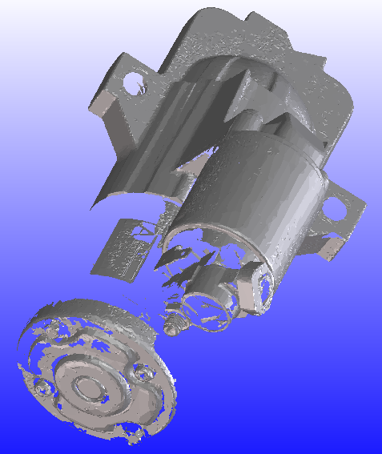

# Import Examples {.title}

# High Quality STL File

Without data reduction: 66,490 facets converted to 66,490 faces.
Model accuracy 0.000001 mm:

Plane recognition: 66,490 facets converted to 7,214 faces. Model accuracy 0.1 mm:

# Scanned STL Model

Without data reduction: 78,124 facets converted to 78,124 faces.
Model accuracy 0.000001 mm:

Plane recognition: 78,124 facets converted to 28,337 faces. Model accuracy 0.1 mm:

