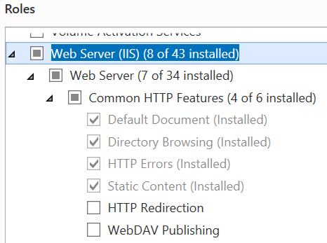
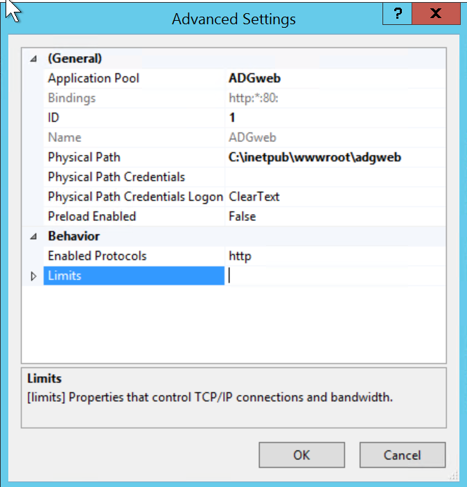

# Extension Module Installation and Startup {.title}

# Prerequisites

* A complete, up-to-date _Creo Elements Direct Modeling_ installation.
* Licenses for Modeling and _ADG_
* Other licenses which are required to perform the operations within this
  configuration. Typical modules may include GD&T, Parametrics, Assembly, or
  database licenses.
* Microsoft .NET Framework.

# Installation Planning

The ADG has several components:

* The ADG Modeling extension. A Modeling module to perform document generation
  tasks in the background.
* The ADG service. Typically runs as Windows service to orchestrate one or more
  Modeling worker processes.
* The ADG webservice. A service component to allow submission of ADG jobs via a
  web interface.

The component specific installation is described in the following sections.

# Installing the _ADG Modeling Extension_

To perform a successfull installation of this _Modeling_ extension module it is
necessary to understand the relationship between the module startup
configuration options and the module install location. Please read section
[Loading/Activating the extension module in _Modeling_](#startupConfig)
before installing the module.

## Installation from ZIP Archive

> The `ADGService` extension module is shipped in a single ZIP
> archive. It can be installed in one of the following ways:

## Using the Installer (recommended)
>
> The extension module comes with an installer written in Lisp (`install.lsp`).
> This installer is located at the root diectory of the ZIP archive. To install
> the extension module using the installer follow these steps:
>
> * Unpack the ZIP archive to a temporary loctation.
> * Start a version of _Modeling_ supported by this extension module.
> * In Modeling load `install.lsp.` by one of the following methods:
>   * Open the _Load_ dialog by clicking on `File --> Open...` or by typing the
>    `CTRL-O` keyboard shortcut, and then choose the `LISP source` file type
>    from
>    the _File type_ options. Browse to the directory the module got unpacked
>    to, and then select `install.lsp`.
>   * Load `install.lsp` from the _Modeling_ command line by typing the Lisp
>     expression:
>     ~~~Lisp
>     ; '...' = path to the unpacked ZIP archive
>     (load ".../install.lsp")
>     ~~~
> * Upon loading the installer, the extension module installation dialog opens.
>   Make sure you understand the implications of the load and startup
>   configuration of this module as described in the next section. If you need
>   some explanation
>   about any of the install options, click the _help_ button <b>&#x2754;</b> at
>   the top right corner of the dialog.
> * Select an installation location and/or startup option and click the
>   _Confirm_ button. The module will be installed to the selected loaction and
>   is ready for use.

## Manual Installation

> The extension module is _portable_ and can be unpacked in any desired
> directory and executed from there.
>
> ## Loading/Activating the Extension Module in _Modeling_ {#startupConfig}
>
> To use the functionality provided by the extension module it needs to be first
> _loaded_ into _Modeling_.
>
> The module can be then activated manually (interactively) or automatically
> when _Modeling_ starts:
>
> ### Loading the Extension Module Interactively
>
>> * Open the _Load_ dialog by clicking on `File --> Open...` or pressing the
>>   `CTRL-O` keyboard shortcut and then choose the `LISP source` file type from
>>   the File type_ options. Browse to the 'ADGService' directory in the
>>   module's installation and then select `startup.lsp`.
>> * Load `startup.lsp` from the _Modeling_ command line by typing the Lisp
>>   expression:
>>
>>   ~~~Lisp
>>   ; '...' -  path to the module's installation directory
>>   (load ".../ADGService/startup.lsp")
>>    ~~~
>
> ### Some Commands to Try
>
>> Type any of the following commands into the _Modeling_ command
>> line and press _Enter_ to execute:
>>
>> ~~~ lisp
>> ; Show information about the `ADGService` extension module
>> (adg:about-module)
>>
>> ; Show help information
>> (adg:display-module-help)
>> ~~~

## Automatically Loading the  Module when _Modeling_ Starts (Autoload)

> The extension module can be loaded automatically on _Modeling_ startup by
> adding startup code to one of the `sd_customize` files:
>
> ~~~ lisp
> ; '...' is the module installation directory
> (load ".../ADGService/startup.lsp")
> ~~~
>
> As described in the _Customization Guide for Administrators and Advanced
> Users_ (_Modeling documentation_),
> `sd_customize` files can exist in any of the _Modeling_ customization
> directories:
> * SD (factory level)
> * Corp (corporate level)
> * Site (site level)
> * User (user level)
>
> It is recommended to let the install dialog add this entry the optimal
> `sd_customize` file by **checking** the _Load when Modeling starts_ option.
> The installer automatically chooses the optimal `sd_customize`
> file location for the selected install location.

## Module 'On-Demand' Activation / Deactivation

> Once the module is loaded it needs to be turned on (activated) using
> the Modeling _Module Management Dialog_ which opens when you click
> on `File -> Modules ...`. All loaded CADM extension Modules can be found in
> the `CADM Extensions` section.
>
> To activate/deactivate a CADM module check/uncheck it in the dialog.

## Activating the Module when Modeling Starts
> To activate the module automatically when Modeling starts, perform these
> steps:
>
> * Open the _Modeling Module Activation_ dialog by clicking on
>   `File -> Modules ... -> Startup ...`.
> * Select the module to auto-activate from the _Modules_ list on the right
>   side.
> * Click 'Add -->' to add the module to the _Modeling Startup Sequence_.

## Loading a Previous Version of the Module

> All versions of a module are installed side-by-side. By default the newest
> installed version is started. In case is should be necessary to temporarily or
> permanently revert back to an older version of the module, this can be easily
> achieved by editing the module's `startup.lsp` file
> ".../ADGService/startup.lsp". `...` represents the module's install
> location. The top of this `startup.lsp` looks like this:
>
> ~~~ lisp
> (in-package :cadm-extension-installer :use '(:lisp :oli))
>
> (let ((module-version "1.2.8") ; <-- change this version
>    ...
> )
> ~~~
>
> To start an older version replace the current version with another installed
> version and save the changes.
>
## Uninstalling the Module

> CADM extension moduled are _portable_ and can be easily deinstalled by
> deleting the module directory.
>
> To delete a particular version of the module, delete the _version_ directory
> from the module's installation directory and update the
> ".../ADGService/startup.lsp" file to load one of the remaining
> versions as described in the previous section.
>
> To delete all versions of the module delete its installation directory
> and remove the load configuration from `sd_customize` or `pesd_startup`.

# The ADG Windows Service

The _ADG Service_ which orchestrates _Modeling_ worker processs
is located in the installation directory of the _Modeling_
extension module in the _adg_ subfolder.

## To register ADG as Windows service:

> 1. Open a DOS cmd shell as **administrator**
> 2. `cd` to the `adg` sub-directory of the _ADG_ installation folder.
> 3. Execute `ADGService -i` to register the ADG as Windows Service.
>    After registration the ASG service is available in the _Services_
>    application:
>    
>
> **Note**: Before the service is started it should be configured. Please see
>   [ADG Service Configuration and Customization](Customization.md)
>
> **Note**: The service can be started via the _Services_ application or by
executing
>`net start ADG` in the dos shell.

## Unregister the ADG Service

> To unregister ADG as Windows service follow these steps:

> 1. Stop the ADG service in the _Services_ application or from a DOS
>    administrator shell
>    by executing `net stop ADG`
> 2. Open a DOS cmd shell as **administrator**
> 3. `cd` to the `adg` sub-directory of the ADG installation folder.
> 4. Execute `ADGService -u` to unregister the ADG as Windows service.
>    **Note**: This stops all worker processes. All unfinished jobs are lost.

# The ADG Webservice

The web user interface of the ADG runs on IIS (Internet Information service).
It uses _ASP.net 5:_ technology

## Preparing IIS in Windows Server (2012 R2)

> 1. In the _Server Manager_ application open the _Add Roles and Features_ dialog
>    and make sure the _Web Server_ role is at least configured like so:
>
>    
>
> 2. To enable the _Blazor_ technology used in the ADG web service
>    the
>    [_ASP.NET Core Runtime 5.0.0 Hosting Bundle_](https://dotnet.microsoft.com/download/dotnet/thank-you/runtime-aspnetcore-5.0.0-windows-hosting-bundle-installer), which
>    includes the .NET Runtime and IIS support needs to be
>    downloaded and installed.

## Deploying Modeling on the server

> The ADGweb web service uses a Modeling installation in the background
> to process jobs coming in via the web service.
>
> 1. Install Modeling. If necessary also install the MEls license
>    server
> 2. Start Modeling and install the _ADGservice_ extension using the installer.
>    Use following options:
>    * Choose Custom Install Location `c:/`
>    * Uncheck _Load always on startup_.

## Deploying the ADG web service components  to IIS

> 1. copy the `adgweb` directory from the ZIP package to
>    `c:/inetpub/wwwroot`
> 2. Create following directories if they do not exist:
>    * `c:/inetpub/wwwroot/adgweb/Data/Uploads`
>    * `c:/inetpub/wwwroot/adgweb/Data/Downloads`
> 3. Make sure `c:/inetpub/wwwroot/adgweb/Data/Uploads` has
>    **write permission** user ``IIS_IUSRS`.
> 4. Open the _Internet Information Services (IIS) Manager_
>    and create a new application with following parameters:
>    
> 5. Create a new _Virtual Directory_ mapping for `Downloads`
>    to `c:/inetpub/wwwroot/adgweb/Data/Downloads`
>    

## Configuring the ADGservice

> The _ADGservice_ can run from the recommended install location
> `c:/ADGservice`. To work with the `ADGweb` web service following
> configuration is necessary.
>
> 1. To be able run the _ADGservice_ as interactive admin user,
>    allow _Full Control_ to `c:/inetpub/wwwroot/adgweb/Data` and
>    its sub-directories.
> 2. Configure the _ADGservice_ by editing _ADGservice.exe.config_
>    like so:
>    ~~~ xml
>    <?xml version="1.0" encoding="utf-8" ?>
>    <configuration>
>      ...
>      <appSettings>
>        <!-- Fully qualified Path to a Modeling executable (SolidDesigner.exe) to use as ADG worker. -->
>        <add key="ADG_WORKER_LOCATION" value="C:/Program Files/PTC/Creo Elements/Direct Modeling 20.1/binx64/SolidDesigner.exe" />
>        <!-- When Modeling does not send any request before this timeout occurs, it is restarted. -->
>        <!-- Time is in minutes -->
>        <add key="ADG_WORKER_TIMEOUT" value="5" />
>        <!-- Time to wait until the ADG worker (Modeling) has connected -->
>        <!-- Time is in minutes -->
>        <add key="ADG_START_TIMEOUT" value="2" />
>        <!-- Number of concurrent worker (Modeling) processes -->
>        <add key="ADG_MAX_WORKER_COUNT" value="1" />
>        <!-- License server host -->
>        <add key="ADG_MELS_HOST" value="win7x64-vm-lab" />
>        <!-- relative path to ADG startup file ()-->
>        <add key="ADG_STARTUP_FILENAME" value="startup" />
>        <!-- Fully qualified path to a ADG working directory -->
>        <!-- When emtpy the directory 'work_dir' in the ADG service installation directory is used -->
>        <add key="ADG_WORK_DIR" value="C:/inetpub/wwwroot/adgweb/Data/Work" />
>        <!-- Fully qualified path to the ADG input directory -->
>        <!-- When emtpy the directory 'input_dir' in the ADG service installation directory is used -->
>        <add key="ADG_INPUT_DIR" value="C:/inetpub/wwwroot/adgweb/Data/Uploads" />
>        <!-- Fully qualified path to the ADG output directory -->
>        <!-- When emtpy the directory 'output_dir' in the ADG service installation directory is used -->
>        <add key="ADG_OUTPUT_DIR" value="C:/inetpub/wwwroot/adgweb/Data/Downloads" />
>        <!-- Fully qualified path to the ADG log directory -->
>        <!-- When emtpy the directory 'logs' in the ADG service installation directory is used -->
>        <add key="ADG_LOG_DIR" value="C:/inetpub/wwwroot/adgweb/Data/Logs" />
>        <!-- Maximum time a worker may run before it is restarted  -->
>        <!-- Time is in minutes -->
>        <add key="ADG_MAX_UPTIME" value="1440" />
>        <!-- Hostname ot IPV4 Address of the SMTP Server -->
>        <add key="ADG_SMTP_HOST" value="hydrogen.portfast.net"/>
>        <!-- SMPT Port -->
>        <add key="ADG_SMTP_PORT" value="25"/>
>        <!-- SMPT User Name -->
>        <add key="ADG_SMTP_USER" value="adgweb@cadm-inc-us.com"/>
>        <!-- SMPT Password -->
>        <add key="ADG_SMTP_PASSWORD" value="********"/>
>        <!-- SMPT connection encryption                                        -->
>        <!-- T to use SSL to encrypt the connection; NIL to disable encryption -->
>        <add key="ADG_SMTP_USE_SSL" value="T"/>
>        <!-- ADG service sender email address -->
>        <!-- When ADG sends out emails this address is used. -->
>        <!-- Preferrably an existing address so that recipients can reply to it. -->
>        <add key="ADG_SERVICE_MAIL_FROM" value="adgweb@cadm-inc-us.com"/>
>        <!-- One or more comma separated email addresses of ADG Administrators. -->
>        <!-- Status and error emails will be sent to these email addresses. -->
>        <add key="ADG_ADMINISTRATOR" value="peter.ernst@cadm-inc-us.com"/>
>        <!-- `CONTINUOUS` Keep all worker processes running continously.       -->
>        <!--   New jobs are picked up from `ADG_INPUT_DIR` by idle workers.    -->
>        <!-- `ON-DEMAND` Start a single, dedicated worker process for each job -->
>        <!--   appearing in `ADG_INPUT_DIR`.                                   -->
>        <add key="ADG_MODE" value="ON-DEMAND"/>
>      </appSettings>
>    </configuration>
>    ~~~

