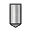

# HOLEWIZARD [Package] {.title}

Primary Lisp package of the `HoleWizard` _Modeling_ extension module.

The package `:HOLEWIZARD` (nicknamed `:HW`) provides dialogs, UICT controls and
configuration tools to enhance the functionality of the built-in _Machining_
module in following areas:

* An UICT based dialog shell for creation and modification of hole features in an
  simple and organized way.
* Configuration tools to define company specific hole features.

# Supported Hole Types

|                                                     | Hole Type(s)
| :-------------------------------------------------: | :------------------------------
|   | Counterbore Through Holes
|     | Countersunk Through/Blind Holes
|             | Drilled Through/Blind Holes
|           | Threaded Through/Blind Holes

# Integration Architecture Diagram

[Integration Architecture](images/HoleWizardArchitecture.png)
# Programming Notes

This package is **not** intended to be included in the `:use` specification of
other packages due to a high probability of name conflicts.
To reference a facility provided by this package, code in another package
must use an explicit package prefix, e.g.

~~~ Lisp
(hw:load-module-customization)
~~~

# Package Contents

## Dialogs

| Name | Summary |
| :---- | :---- |
| [`HW_SETTINGS`](HW_SETTINGS.dia.md) | Edit customizable settings for the `HoleWizard` extension module. |

## Variables / Parameters / Constants

| Name | Summary |
| :---- | :---- |
| [`*user-interface-integration*`](AAuser-interface-integrationAA.var.md) | Modeling user interface integration level {`keyword`} for this extension module. |
| [`+module-id+`](+module-id+.var.md) | The extension module ID. |

## (Generic) Functions / Macros / Accessors

| Name | Summary |
| :---- | :---- |
| [`about-module`](about-module.fun.md) | Show the `HoleWizard` _about_ information in the _Modeling_ output textbox. |
| [`activate-module`](activate-module.fun.md) | Activate this module. |
| [`deactivate-module`](deactivate-module.fun.md) | Deactivate this module. |
| [`display-module-help`](display-module-help.fun.md) | Display a module help page in the browser. |
| [`get-available-commands`](get-available-commands.fun.md) | Get a list of commands availalable for this module |
| [`get-module-manifest`](get-module-manifest.fun.md) | Get the extension module manifest. |
| [`load-module-customization`](load-module-customization.fun.md) | Load or re-load the module customizations. |
| [`module-active-p`](module-active-p.fun.md) | Predicate to termine if this extension module is active. |
| [`show-holewizard`](show-holewizard.fun.md) | Show the _Hole Feature Tool_ UICT UICT dialog. |
