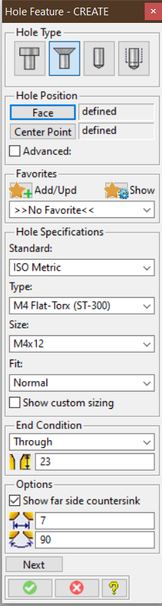
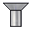
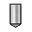

# Modeling Extension Module _Hole Features_ {.title}

The _Hole Feature_ extension substantialy enhances the built-in _Machining_ module and
provides:

{.rightfloat}

* A new graphical _Hole Feature Tool_ dialog to allow hole creation and modification
  in an organized, easy-to-use way, including
  * Management of frequently used hole specifications (favorites)
  * Simple and advanced user interface
  * All hole types accessible from one dialog

* Configuration tools to define and manage hole features compliant with
  company standards. Full support of the _Modeling_ customization infrastructure;
  * hole features can be specified at _user_, _site_, and _company_ levels.
  * Customizable feature label templates

* Support for common industry standard hole types

  |                                                     | Hole Type(s)
  | :-------------------------------------------------: | :------------------------------
  |   | Counterbore Through Holes
  |     | Countersunk Through/Blind Holes
  |             | Drilled Through/Blind Holes
  |           | Threaded Through/Blind Holes

  All hole features from the _Machining_ module are available by default
# Getting Started{.unfloat}

* [Extension Module Installation and Startup](Installation.md)
* [Extension Module Customization Overview](Customization.md)
* [The Extension Module User Interface](UI.md)

# Programming Interfaces

## Lisp packages in this module

| Name | Summary |
| :---- | :---- |
| [`holewizard`](HOLEWIZARD/HOLEWIZARD.pkg.md) | Primary Lisp package of the `HoleWizard` _Modeling_ extension module. |
