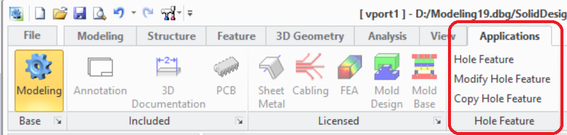

# The Extension Module User Interface {.title}
    
The functionality of this extension module is accessible from the _Modeling_ user interface
in several locations. The most used dialogs of the extension module are accessible via a command group in
the **Extensions** tab of the
_Modeling_ ribbon bar.

{.leftfloat}
    
1. TODO: Describe UI items
2. Help actions:
   * Display the doc documentation for the Hole Features
   * Display general module information. See also [`holewizard:about-module`](HOLEWIZARD/about-module.fun.md)
3. [`holewizard:HW_SETTINGS`](HOLEWIZARD/HW_SETTINGS.dia.md) (Edit customizable settings for the `HoleWizard` extension module)

Module help and management dialogs are available in following locations:

* _File -&gt; Settings -&gt; Extensions -&gt;_
  **Hole Feature Settings ...**: The [`holewizard:HW_SETTINGS`](HOLEWIZARD/HW_SETTINGS.dia.md) (Edit customizable settings for the `HoleWizard` extension module)
* _File -&gt;_ **Modules**_: Opens the _Modeling_ module management dialog where the extension module
  can be (de)activated in the CADM Extensions tab by
  (de)selecting _Hole Features_
* In the <b>&#x2754;</b> command group located at the right end of the _Modeling_ ribbon bar where
  the action _Hole Features_ opens the module documentation in the browser.

