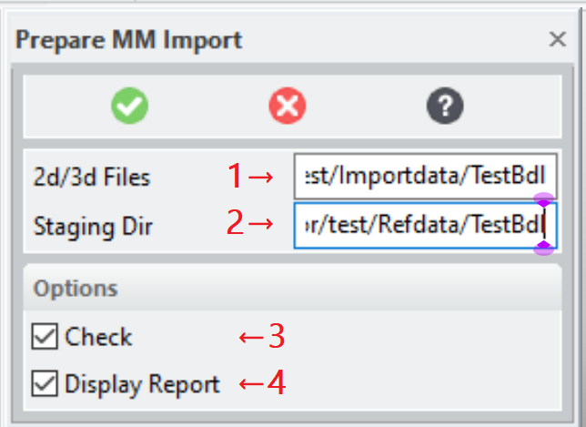

# KEYSIGHT_MM_IMPORT_ASSEMBLER [Public Dialog] {.title}

Package: [`keysight-migrator`](KEYSIGHT-MIGRATOR.pkg.md) (Nick name(s): `:kym`) {.package}

Stage _Modeling_ 2d and 3d models for _ModelManager_ check-in.

This dialog can be activated by:
* Selecting the command Prepare MM Import in the Keysight Migrator group
  of the _Modeling_ ribbon (see also [The Extension Module User Interface](../UI.md)
* Typing `KEYSIGHT_MM_IMPORT_ASSEMBLER` into the _Modeling_ command line.

# Dialog

{.rightfloat}

1. Location of the input directory containing 2d/3d data for check-in:
   * 3d Models (*.sd?; *.sd?c; *.xmit (ME30); *.bdl; *.pkg; *.sdexp)
   * Annotation or plain ME10 drawings (*.mi; *.ami).

   The sub-structure is up to the user but it is recommended to keep related files together
   in sub-directories.

2.  The 2d/3d models staged for _ModelManager_ import.

    * 3d models are staged in the 'models' sub-directory.  Filenames in this sub-directory
      are component sysids to guarantee uniqueness.
    * Annotation drawings are staged in the `drawings.ami` sub-directory.
    * Plain ME10(Drafting drawings are staged in the `drawings.mi` sub-directory.
    * Various log files (*.lsp) are generated in the staging directory:
      * `toc.lsp` - Records of type [`cad-fileinfo`](cad-fileinfo.struct.md) describing the files
        loaded and staged for ModelManager check-in-
      * `ami-drawings.lsp` - Records of type [`ami-drawing-info`](ami-drawing-info.struct.md) describing the
        relationship of Annotation drawings with the 3d model.
      * `components.lsp` - Records of type [`instance-info`](instance-info.struct.md) and [`contents-info`](contents-info.struct.md)
        describing the structure components of the models loaded for processing.
      * `analytics.lsp` - Records of type [`model-status`] and [`ami-drawing-status`]
        decribing the associations between 3d and 2d model and also a quality (part check) assessment of the 3d model.
    * A human-readable report file `report.htm` generated in the staging directory.
      The report is generated from the information available in the log files.

    The structure diagram of this directory is:

    ~~~bob
    #
    +-- drawings.ami
    |      |
    |      '-- *.ami (Annotation drawings)
    |
    +-- drawings.mi
    |      |
    |      '-- *.mi (Drafting/ME10 drawings)
    |
    +-- models
    |      |
    |      '-- *.sd* (3d models)
    |
    +-- *.lsp (Log files)
    |
    |
    '-- report.html
    ~~~

# Description

This dialog implements stage 1 of the migration process. For stage 1 _ModelManager_ is
**not** is not required nor is any specific knowledge about _ModelManager_

~~~ bob
Migration Stage 1 Process Diagramm
...........................
+------------------------------------------------------+
|           Stage 1 (not connected to MM)              |
| .-------------------------.  .---------------------. |
| | Automated Model Scan    |  | Interactive         | |
| | and Conflict Resolution |  | Error Resolution    | |
| '---^-------------------.-'  '-.-------------------' |
+-----|-------------------|------|---------------------+
      |           .-------+------'
      |           |       |
   .--v-----------v--.    |                     .-----------------.
  (  Input Directory  )   '------------------->( Staging Directory )
  /'-----------------'\                        /'-----------------'\
  |                   |                        |                   |
  |  .---+    .---+   |                        |  .---+    .---+   |
  | /  .-+-+ /  .-+-+ |                        | /  .-+-+ /  .-+-+ |
  | | /    | | /    | |                        | | /    | | /    | |
  | +-| 2d | +-| 3d | |                        | +-| 2d | +-| 3d | |
  |   +----+   +----+ |                        |   +----+   +----+ |
  '-------------------'                        |       .---+       |
                                               |      /  .-+--+    |
                                               |      | / log |    |
                                               |      +-|     |    |
                                               |        +-----+    |
                                               '-------------------'
~~~

All models and drawings contained in the `Input Directory` are loaded into
_Modeling_ to perform specific actions:
* **Drawings**:
  * Determine the drawing type (Annotation or ME10).
  * Log _drawing owners for_ _Annotation_ drawings.
  * Copy _Annotation_ to `drawings.ami` in the `Staging Directory`
  * Copy _Drafting (ME10)_ to `drawings.ami` in the `Staging Directory`
* **3d Models**
  * Reintegrate versioned parts
  * Mark simplified objects as _untouchable_ and delete the simplifiication feature.
  * Mark PC Board Assemblies as _untouchable_ and delete any contained coordinate systems.
  * Run a part-check.
  * Resolve SYSID conflicts (by assigning new sysids to convert
    sysid conflicts into  model name conflicts).
  * Save each loaded model (top-level instance) to `models` in the `Staging Directory`
* Finally, if option `DISPLAY_REPORT` is active a report is displayed in the default browser.

# Syntax

~~~ bob
                                      .-<-----------------------<-----------------<-.
                                      |                                             |
  +-------------------------------+   |  .------------------.       .-----------.   |   +----------+
->| KEYSIGHT_MM_IMPORT_ASSEMBLER  |->-O->| :INPUT_DIRECTORY |--->--/ directory /-->-O->-| COMPLETE |
  +-------------------------------+   |  '------------------'     '-----------'     |   +----------+
                                      |  .--------------------.     .-----------.   |
                                      O->| :STAGING_DIRECTORY |->--/ directory /-->-O
                                      |  '--------------------'   '-----------'     |
                                      |  .--------.                 .----------.    |
                                      O->| :CHECK |------------->--/ :ON/:OFF /--->-O
                                      |  '--------'               '----------'      |
                                      |  .-----------------.        .----------.    |
                                      '->| :DISPLAY_REPORT |---->--/ :ON/:OFF /--->-'
                                         '-----------------'      '----------'
~~~

## Options

`:INPUT_DIRECTORY`
:   The input directory containing 2d _Annotation_ and MI drawings (*.mi; *.ami) as well as 3d models of
    any format supported by _Modeling_ (*.sd?; *.sd?c; *.xmit (ME30); *.bdl; *.pkg; *.sdexp).

`:STAGING_DIRECTORY`
:   3d models and drawings The models in native _Modeling_ format (.sd*; *.ami: *.mi) and log files (*.lsp)
    to pass check-in information to the stage 2 dialog [`KEYSIGHT_MM_ASSISTED_CHECKIN`](KEYSIGHT_MM_ASSISTED_CHECKIN.dia.md).

    Filenames in the `models` sub-directory are component sysids to guarantee uniqueness.

`:CHECK`
:   Option to run a part check to all parts.

`:DISPLAY_REPORT`
:   Show a report when all models are staged is finished.

