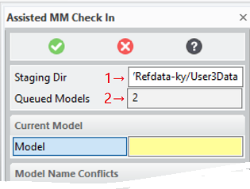
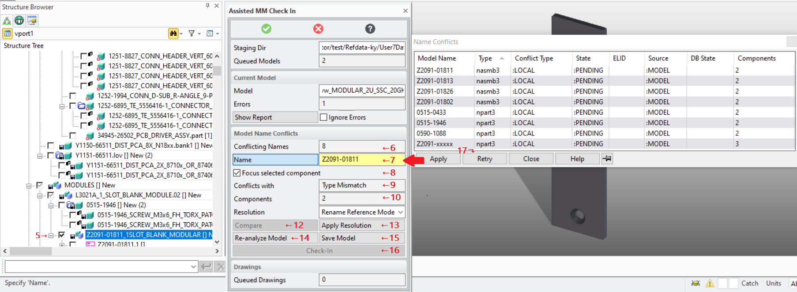
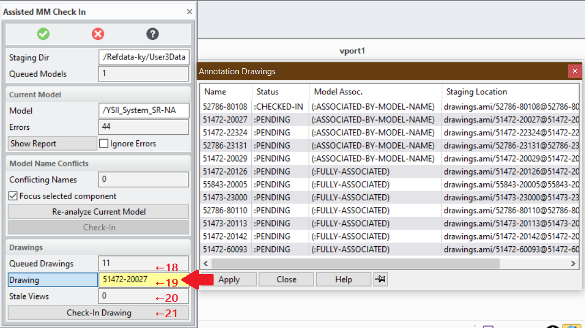

# KEYSIGHT_MM_ASSISTED_CHECKIN [Public Dialog] {.title}

Package: [`keysight-migrator`](KEYSIGHT-MIGRATOR.pkg.md) (Nick name(s): `:kym`) {.package}

Assisted _ModelManager check-in of 2d/3d models in a staging directory

This dialog can be activated by:
* Selecting the command Prepare MM Import in the Keysight Migrator group
  of the _Modeling_ ribbon (see also [The Extension Module User Interface](../UI.md)
* Typing `KEYSIGHT_MM_ASSISTED_CHECKIN` into the _Modeling_ command line.

# Dialog

The dialog has two main distinct, sequential phases to facilitate check-in of 3d models (phase 1) and drawings (phase 2).
Before drawings can be checked-in, the 3d model has to be checked-in to _ModelManager sucessfully_.

{.rightfloat}

The assisted check-in process begins with selection of the staging directory which was producedmust  by the.
[`KEYSIGHT_MM_IMPORT_ASSEMBLER`](KEYSIGHT_MM_IMPORT_ASSEMBLER.dia.md) dialog.

1. Selection of the staging folder (generated by the [`KEYSIGHT_MM_IMPORT_ASSEMBLER`](KEYSIGHT_MM_IMPORT_ASSEMBLER.dia.md) dialog).
2. Displays the number of models in the selected staging folder which are available for check-in.

## Checking in 3d Models{.unfloat}

Several steps are needed to prepare a model for _ModelManager_ check-in:

* Model Selection{id=ModelSelection}

  

  Each model has to be loaded one-by-one for check-in.

  1. The model to process can be chosen
     from the _Import Queue_ selection table by double left-click or by single click to select followed by a click
     on the `Apply` button.
  2. The number of components in the current models which were flagged by the first migration stage.
     Since these errors were not repaired in stage 1, it is assumed that the model is supposed to be checked-in
     in its corrupt state.
  3. Show the error report created in the migration stage 1. This action is only available if there are any errors
  4. Option to allow a model to be checked-in despite of errors. :warning: Must be checked in order to check-in a corrupted model.

* Name Conflict Resolution{id=NameConflictSelection}

  In _ModelManager_ each distinct, sharable structure component must have a unique name. If more than one structure component share the
  same model model name, that conflict must be resolved by using the tools provided by actions in the _Model Name Conflicts_
  panel of this dialog or manually by manipulating the currently loaded model.

  

  5. A model name conflict selected for conflict resolution. All model components with the conflicting name are highlighted in
     the structure browser.
  6. The number of model name conflicts found in the current model.
  7. The currently selected model name selected for conflict resolution. The model name can directly selected in the
     structure browser by double-click, or in the _Name Conflicts_ table.
  8. Information about the type of conflict. Can be
     * _Type mismatch_ - Components of different type (part/assembly) have the same name.
     * _Local_ - More than one local component of the same type have the same name.
     * _Database ID_ - name revision and status of a component with that name in the database
  9. Option to automatically focus on the component selected for conflict resolution when checked.
  10. The number of distinct components sharing the same model name.
  11. Options to resolve the name conflict. Model name conflicts are resolved pairwise. Hence it might be necessary
      to resolve more than one conflict for the same model name.

      The resolution options depend on the context of conflict:

      +---------------+-----------------+---------------------------+
      | Check-Model   | Component Types | Resolution Options        |
      | Source        |                 |                           |
      +===============+=================+===========================+
      | database      | incompatible    | * Rename Reference Model  |
      +---------------+-----------------+---------------------------+
      | database      | compatible      | * Rename Reference Model  |
      |               |                 | * Replace Reference Model |
      +---------------+-----------------+---------------------------+
      | local         | incompatible    | * Rename Reference Model  |
      |               |                 | * Rename Check Model      |
      +---------------+-----------------+---------------------------+
      | local         | compatible      | * Rename Reference Model  |
      |               |                 | * Rename Check Model      |
      |               |                 | * Replace Reference Model |
      |               |                 | * Replace Check Model     |
      +---------------+-----------------+---------------------------+

      **Check Model**
      :   The term _Check Model_ refers to a model in or loaded from the _ModelManager_ database or a (random) local
          model which takes part in the conflict.

      **Reference Model**
      :   The term 'Reference Model' always refers to a local model which participates in a name conflict.

      **Rename ...**
      :   A conflict resolution option which assigns a unique, auto-generated model name to the
          _Check-_ or _Reference Model_

      **Replace ...**
      :   A conflict resolution option which **destructively** replaces all instances of a part/assembly with the
          _Check Model_, which is another part/assembly. If the _Check Model_ is not in-session, it is loaded from the
          database.

          :warning: Always use the `Compare` option **(11)** to make sure the _Replace_ operation does not change
          the model in a bad way. In cases _Replace_ did change the model in a bad way the _UNDO_ action can be used to
          revert the change. In that case the the model **must** be scanned again with the _Re-Analyze_ action **(13)**
          to pick up the changes.

  12. Compare two conflicting components. :warning: The comparison is performed by an external dialog which terminates
      this dialog. Just restart this dialog once comparison is complete to resume name conflict resolution.
  13. Apply the resolution selected in **(11)**.
  14. Re-analyze the current model after a manual model change including rollbacks (_UNDO_) of previous conflict
      resolutions. :warning: Model Analysis is an expensive operation and may take a while.
  15. Check-in the current model to _ModelManager_. This actions is available only when all conflicts are resolved.
      This action opens the _ModelManager_ _Save Modified_ dialog to perform final checks and allow for a review
      of the components being checked in.
  16. Retry failed queries. Particularly when working with large models, model name queries fail. The `Retry` button can be used
      to recover from these failures.

      

## Checking in Drawings

Once a model has been successfully checked-in to _ModelManager_ any drawing associated with that model can be checked-in:

17. The number of drawings associated with the current model.
18. The Annotation drawing loaded for the current model.Can be selected in the drawing selection table.
19. The number of views on the drawing which could not be associated with any 3d component of the currently
    loaded model.
20. Action button to check-in the currently loaded drawing.

# Description

This dialog implements stage 2 of the migration process. Basic _ModelManager_ know-how is required.

~~~ bob
Migration Stage 2 Process Diagramm
...........................
            +------------------------------------------------------+
            |           Stage 2 (Connected to MM)                  |
            | .-------------------------.  .---------------------. |
            | | Rule based automated    |  | Interactive         | |
            | | MM check-in             |  | Conflict Resolution | |
            | '-^-----------------------'  '-^----------^--------' |
            +---|----------------------------|----------|----------+
                |                            |          |
                |                            |          |
 .--------------v--.                         |     .----v--------.
( Staging Directory )<-----------------------'    ( Model Manager )
/'-----------------'\                             /'-------------'\
|                   |                             |               |
|  .---+    .---+   |                             | #             |
| /  .-+-+ /  .-+-+ |                             | +--O          |
| | /    | | /    | |                             |    |          |
| +-| 2d | +-| 3d | |                             |    +--O       |
|   +----+   +----+ |                             |    +--O       |
|       .---+       |                             |               |
|      /  .-+--+    |                             '---------------'
|      | / log |    |
|      +-|     |    |
|        +-----+    |
'-------------------'
~~~

# Syntax

~~~ bob
                                      .-<------------------------------<----------------------<--.
                                      |                                                          |
  +-------------------------------+   |  .--------------------.            .-----------.         |   +----------+
->| KEYSIGHT_MM_ASSISTED_CHECKIN  |->-O->| :STAGING_DIRECTORY |-------->--/ directory /------>---O->-| COMPLETE |
  +-------------------------------+      '--------------------'          '-----------'           |   +----------+
                                      .-<------------------------------<---------------------<---O
                                      |  .----------------.                .---------------.     |
                                      '->| :CURRENT_MODEL |------------>--/ part/assembly /-->---O
                                         '----------------'              '---------------'       |
                                      .-<------------------------------<---------------------<---O
                                      |  .---------------------.           .---------------.     |
                                      O->| :CURRENT_MODEL_NAME |------->--/ part/assembly /-->---O
                                      | '----------------------'         '---------------'       |
                                      |  .---------------------------.     .----------.          |
                                      O->| :FOCUS_SELECTED_COMPONENT |->--/ :ON/:OFF /------->---O
                                      |  '---------------------------'   '----------'            |
                                      |  .--------------------.                                  |
                                      O->| :SHOW_ERROR_REPORT |---->------------------------->---O
                                      |  '--------------------'                                  |
                                      |  .----------------.                .----------.          |
                                      O->| :IGNORE_ERRORS |------------>--/ :ON/:OFF /------->---O
                                      |  '----------------'              '----------'            |
                                      |  .--------------.                  .--------.            |
                                      O->| :RESOLUTION |--------------->--/ option /--------->---O
                                      |   '-------------'                '--------'              |
                                      |  .----------.                                            |
                                      O->| :COMPARE |------------------>--------------------->---O
                                      |  '----------'                                            |
                                      |  .-------------------.                                   |
                                      O->| :APPLY_RESOLUTION |--------->--------------------->---O
                                      |  '-------------------'                                   |
                                      |  .-----------------------.                               |
                                      O->| :RESCAN_CURRENT_MODEL |----->--------------------->---O
                                      |  '-----------------------'                               |
                                      |  .-----------.                                           |
                                      '->| :CHECK_IN |----------------->--------------------->---O
                                         '-----------'                                           |
                                      .-<------------------------------<---------------------<---O
                                      |  .------------------.              .--------.            |
                                      O->| :CURRENT_DRAWING |---------->--/ drawing /-------->---O
                                      |  '------------------'            '---------'             |
                                      |  .-------------------.                                   |
                                      '->| :CHECK_IN_DRAWING |--------->--------------------->---O
                                         '-------------------'
~~~

# Options

`:STAGING_DIRECTORY`
:   The models in native _Modeling_ format (.sd*) as prepared by the migration
    stage 1 dialog [`KEYSIGHT_MM_IMPORT_ASSEMBLER`](KEYSIGHT_MM_IMPORT_ASSEMBLER.dia.md).
    Filenames are component sysids to guarantee uniqueness.

`:CURRENT_MODEL`
:   The current model loaded into session for conflict resolution and check-in.

`:CURRENT_MODEL_NAME`
:   The 3d component currently selected for conflict resolution.

`:FOCUS_SELECTED_COMPONENT`
:   Option to focus on a component selected for conflict resolution to only draw that component
    in the graphical viewport.

`:SHOW_ERROR_REPORT`
:   Show the error report generated in phase one for the selected component.

`:IGNORE_ERRORS`
: Option to ignore model errors which would otherwise prevent a check-in.

`:RESOLUTION`
:   A list of choices for resolving a conflict.
    * `:rename-local` - Assign a unique model name to a local (reference) component.
    * `:rename-check` - Assign a unique model name to another local (check) component.
    * `:replace-local-by-db` - Replace a local (reference) model by a model loaded from the database.
    * `:replace-reference-by-check`-Replace a local (reference) model by another local (check) model.
    * `:replace-check-by-reference` - Replace a local (check) model by another local (refernce) model.

`:COMPARE`
:   Perform a model compare of a local (reference) model and a another (check) model which can be local
    or from the database.
    
`:APPLY_RESOLUTION`
:   Apply the selected resolution-

`:RESCAN_CURRENT_MODEL`
:   Re analyze the current model after a change which was performed outside the
    _Assisted Check-in_ dialog.
    
`:CHECK_IN`
:   Action to check the current model in to _ModelManager_ after all conflicts have been resolved,

`:CURRENT_DRAWING`
:   The drawing currently loaded into session for check-in.

`:CHECK_IN_DRAWING`
:   Check-in current drawing into _ModelManager_.

