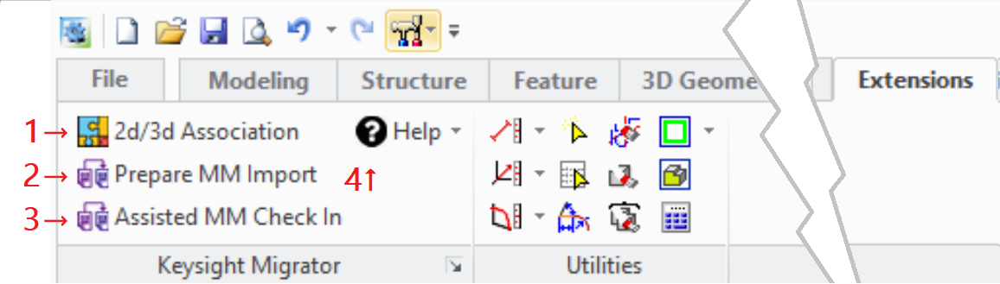

# The Extension Module User Interface {.title}
    
The functionality of this extension module is accessible from the _Modeling_ user interface
in several locations. The most used dialogs of the extension module are accessible via a command group in
the **Extensions** tab of the
_Modeling_ ribbon bar.

{.rightfloat}

1. [`keysight-migrator:KEYSIGHT_DRAWING_ASSOCIATOR`](KEYSIGHT-MIGRATOR/KEYSIGHT_DRAWING_ASSOCIATOR.dia.md) (Associate drawings with 3d models using a _Master Extraction List_)
2. [`keysight-migrator:KEYSIGHT_MM_IMPORT_ASSEMBLER`](KEYSIGHT-MIGRATOR/KEYSIGHT_MM_IMPORT_ASSEMBLER.dia.md) (Stage _Modeling_ 2d and 3d models for _ModelManager_ check-in)
3. [`keysight-migrator:KEYSIGHT_MM_ASSISTED_CHECKIN`](KEYSIGHT-MIGRATOR/KEYSIGHT_MM_ASSISTED_CHECKIN.dia.md) (Assisted _ModelManager check-in of 2d/3d models in a staging directory)
4. Help actions:
   * Display the documentation for the Keysight Migrator extension module
   * Display general module information. See also [`keysight-migrator:about-module`](KEYSIGHT-MIGRATOR/about-module.fun.md)

Module help and management dialogs are available in following locations:

* _File -&gt; Settings -&gt; Extensions -&gt;_
  **ky_migrator Settings ...**: The [`keysight-migrator:KYM_SETTINGS`](KEYSIGHT-MIGRATOR/KYM_SETTINGS.dia.md) (Edit customizable settings for the `ky_migrator` extension module)
* _File -&gt;_ **Modules**: Opens the _Modeling_ module management dialog where the extension module
  can be (de)activated in the CADM Extensions tab by
  (de)selecting _Keysight Migrator_
* In the <b>&#x2754;</b> command group located at the right end of the _Modeling_ ribbon bar where
  the action _Keysight Migrator_ opens the module documentation in the browser.

