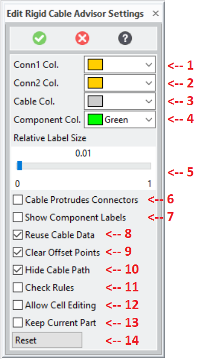

# RCA_SETTINGS [Public Dialog] {.title}

Package: [`soco-cables`](SOCO-CABLES.pkg.md) (Nick name(s): `:rca` `:soco_cables`) {.package}

Edit customizable module settings.

The settings dialog can be activated via the _Modeling Settings_ user interface
    (`File -> Settings -> Extensions -> Rigid Cable Settings ...`).

**See also**: The [Rigid Cable Advisor Customization Guide](../rca_customize.html)
for all customization options.

# Dialog

{.leftfloat}

1. Changes [`*rca-conn1-color*`](AArca-conn1-colorAA.var.md) (Default color for connector1 {`integer`})
2. Changes [`*rca-conn2-color*`](AArca-conn2-colorAA.var.md) (Default color for connector1 {`integer`})
3. Changes [`*rca-cable-color*`](AArca-cable-colorAA.var.md) (Default color for cables {`integer`})
4. Changes [`*rca-comp-color*`](AArca-comp-colorAA.var.md) (Default color for components {`integer`})
5. Changes [`*rca-lbl-rel-size*`](AArca-lbl-rel-sizeAA.var.md) (Relative size of label with regard to total length of cable {`float`})
6. Changes [`*rca-model-tip-dist*`](AArca-model-tip-distAA.var.md) (Let cable protrude through the connector {`boolean`})
7. Changes [`*rca-create-lbl-comp-feedback*`](AArca-create-lbl-comp-feedbackAA.var.md) (Determine if labels for components should be shown {`boolean`})
8. Changes [`*rca-use-previous-cabledata*`](AArca-use-previous-cabledataAA.var.md) (Reuse previous points if creating a new cable {`boolean`})
9. Changes [`*rca-auto-clear-offset-points*`](AArca-auto-clear-offset-pointsAA.var.md) (Should point offset values be reset (i.e)
10. Changes [`*rca-display-cable-path-only*`](AArca-display-cable-path-onlyAA.var.md) (Only display cable path when adding/editing points {`boolean`})
11. Changes [`*rca-check-illegal-cond*`](AArca-check-illegal-condAA.var.md) (Show violated rules in display window {`boolean`})
12. Changes [`*rca-enable-cell-editing*`](AArca-enable-cell-editingAA.var.md) (Allow editing of point values directly in table (no multi-selection) {`boolean`})
13. Changes [`*rca-keep-current-part*`](AArca-keep-current-partAA.var.md) (Keep current part when editing cable (if nil, cable becomes current part) {`boolean`})
14. Reset the settings to the startup configuration.

# Syntax

~~~ mermaid
graph LR

action(RCA_SETTINGS) --> in{ }

in --> MODEL_TIP_DIST(:MODEL_TIP_DIST)
MODEL_TIP_DIST -.-> MODEL_TIP_DIST-arg[":YES | :NO"]
MODEL_TIP_DIST-arg --> out{ }

in --> CONN1_COLOR(:CONN1_COLOR)
CONN1_COLOR -.-> CONN1_COLOR-arg[rgb]
CONN1_COLOR-arg --> out{ }

in --> CONN2_COLOR(:CONN2_COLOR)
CONN2_COLOR -.-> CONN2_COLOR-arg[rgb]
CONN2_COLOR-arg --> out{ }

in --> CABLE_COLOR(:CABLE_COLOR)
CABLE_COLOR -.-> CABLE_COLOR-arg[rgb]
CABLE_COLOR-arg --> out{ }

in --> COMP_COLOR(:COMP_COLOR)
COMP_COLOR -.-> COMP_COLOR-arg[rgb]
COMP_COLOR-arg --> out{ }

in --> REL_LBL_SIZE(:REL_LBL_SIZE)
REL_LBL_SIZE -.-> REL_LBL_SIZE-arg[scale]
REL_LBL_SIZE-arg --> out{ }

in --> LBL_COMP_FEEDBACK(:LBL_COMP_FEEDBACK)
LBL_COMP_FEEDBACK -.-> LBL_COMP_FEEDBACK-arg[":YES | :NO"]
LBL_COMP_FEEDBACK-arg --> out{ }

in --> USE_PREVIOUS_CABLEDATA(:USE_PREVIOUS_CABLEDATA)
USE_PREVIOUS_CABLEDATA -.-> USE_PREVIOUS_CABLEDATA-arg[":YES | :NO"]
USE_PREVIOUS_CABLEDATA-arg --> out{ }

in --> CLEAR_OFFSET_POINTS(:CLEAR_OFFSET_POINTS)
CLEAR_OFFSET_POINTS -.-> CLEAR_OFFSET_POINTS-arg[":YES | :NO"]
CLEAR_OFFSET_POINTS-arg --> out{ }

in --> CABLE_PATH_ONLY(:CABLE_PATH_ONLY)
CABLE_PATH_ONLY -.-> CABLE_PATH_ONLY-arg[":YES | :NO"]
CABLE_PATH_ONLY-arg --> out{ }

in --> CHECK_RULES(:CHECK_RULES)
CHECK_RULES -.-> CHECK_RULES-arg[":YES | :NO"]
CHECK_RULES-arg --> out{ }

in --> ENABLE_CELL_EDITING(:ENABLE_CELL_EDITING)
ENABLE_CELL_EDITING -.-> ENABLE_CELL_EDITING-arg[":YES | :NO"]
ENABLE_CELL_EDITING-arg --> out{ }

in --> KEEP_CURRENT_PART(:KEEP_CURRENT_PART)
KEEP_CURRENT_PART -.-> KEEP_CURRENT_PART-arg[":YES | :NO"]
KEEP_CURRENT_PART-arg --> out{ }

in --> reset(:RESET)
reset --> out

out--> in
out --> OK(COMPLETE)
~~~

# Options

`:MODEL_TIP_DIST` {`:YES` | `:NO`}
:   Configures [`*rca-model-tip-dist*`](AArca-model-tip-distAA.var.md) (Let cable protrude through the connector {`boolean`})

`:CONN1_COLOR` {`integer`}
:   Configures [`*rca-conn1-color*`](AArca-conn1-colorAA.var.md) (Default color for connector1 {`integer`})

`CONN2_COLOR` {`integer`}
:   Configures [`*rca-conn2-color*`](AArca-conn2-colorAA.var.md) (Default color for connector1 {`integer`})

`:CABLE_COLOR` {`integer`}
:   Configures [`*rca-cable-color*`](AArca-cable-colorAA.var.md) (Default color for cables {`integer`})

`:COMP_COLOR` {`integer`}
:   Configures [`*rca-comp-color*`](AArca-comp-colorAA.var.md) (Default color for components {`integer`})

`:REL_LBL_SIZE` {`float`}
:   Configures [`*rca-lbl-rel-size*`](AArca-lbl-rel-sizeAA.var.md) (Relative size of label with regard to total length of cable {`float`})

`:LBL_COMP_FEEDBACK` {`:YES` | `:NO`}
:   Configures [`*rca-create-lbl-comp-feedback*`](AArca-create-lbl-comp-feedbackAA.var.md) (Determine if labels for components should be shown {`boolean`})

`:USE_PREVIOUS_CABLEDATA` {`:YES` | `:NO`}
:   Configures [`*rca-use-previous-cabledata*`](AArca-use-previous-cabledataAA.var.md) (Reuse previous points if creating a new cable {`boolean`})

`:CLEAR_OFFSET_POINTS` {`:YES` | `:NO`}
:   Configures [`*rca-auto-clear-offset-points*`](AArca-auto-clear-offset-pointsAA.var.md) (Should point offset values be reset (i.e)

`:CABLE_PATH_ONLY` {`:YES` | `:NO`}
:   Configures [`*rca-display-cable-path-only*`](AArca-display-cable-path-onlyAA.var.md) (Only display cable path when adding/editing points {`boolean`})

`:CHECK_RULES` {`:YES` | `:NO`}
:   Configures [`*rca-check-illegal-cond*`](AArca-check-illegal-condAA.var.md) (Show violated rules in display window {`boolean`})

`:ENABLE_CELL_EDITING` {`:YES` | `:NO`}
:   Configures [`*rca-enable-cell-editing*`](AArca-enable-cell-editingAA.var.md) (Allow editing of point values directly in table (no multi-selection) {`boolean`})

`:KEEP_CURRENT_PART` {`:YES` | `:NO`}
:   Configures [`*rca-keep-current-part*`](AArca-keep-current-partAA.var.md) (Keep current part when editing cable (if nil, cable becomes current part) {`boolean`})

