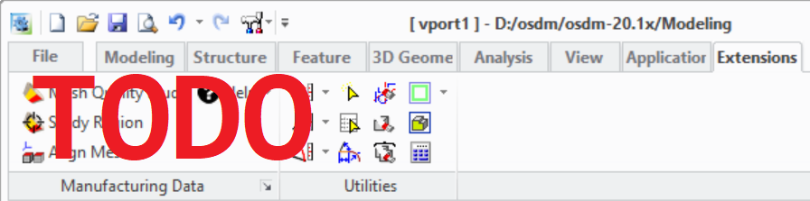

# The Extension Module User Interface {.title}

The functionality of this extension module is accessible from the _Modeling_ user interface
in several locations. The most used dialogs of the extension module are accessible via a command group in
the **Extensions** tab of the
_Modeling_ ribbon bar.

{.leftfloat}

1. The Cable Modeler dialog
2. Help actions:
   * Display the doc documentation for the Rigid Cable Advisor
   * Display general module information. See also [`soco-cables:about-module`](SOCO-CABLES/about-module.fun.md)
3. [`soco-cables:RCA_SETTINGS`](SOCO-CABLES/RCA_SETTINGS.dia.md) (Edit customizable module settings)

Module help and management dialogs are available in following locations:

* _File -&gt; Settings -&gt; Extensions -&gt;_
  **Rigid Cable Settings ...**: The [`soco-cables:RCA_SETTINGS`](SOCO-CABLES/RCA_SETTINGS.dia.md) (Edit customizable module settings)
* _File -&gt;_ **Modules**: Opens the _Modeling_ module management dialog where the extension module
  can be (de)activated in the CADM Extensions tab by
  (de)selecting Rigid Cable Advisor
* In the <b>&#x2754;</b> command group located at the right end of the _Modeling_ ribbon bar where
  the action _Rigid Cable Advisor_ opens the module documentation in the browser.
