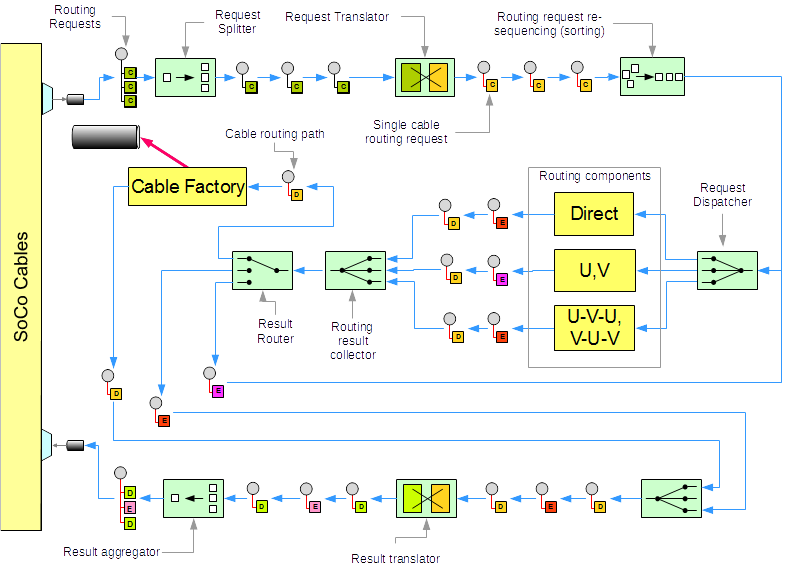
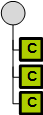
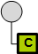
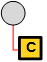
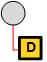
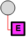
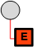

# High Level Architecture and Data Flow

Conceptual view showing how routing requests flow through the routing system and get
converted into cable paths and 3d cables.

## Messages types flowing through the system

<table border="1">
<tr><td></td>
<td>Collection of cable routing requests.</td></tr>

<tr><td></td>
<td>A single cable routing request. The request specifies routing details such as:

* cable start and end locations
* Lead-in and lead-out zones. These zones have to be kept clear.
  No cable can be routed in these zones
* Layers available for routing
* Routing methods to use
* Cable radius
* Bend radius
</td></tr>

<tr><td></td>
<td>Routing request optimized for the routing engine</td></tr>

<tr><td></td>
<td>Successful Routing result. Contains ,among other cable parameters, the cable spine, layer used for routing,
    and routing method. Messages of this type will be routed to the
    Cable Factory for construction of the 3d cable part</td></tr>

<tr><td></td>
<td>Incomplete Routing result due to clearance violation of the cable
    being routed with respect to other parts or cables of the 3d model
    Messages of this type will be re-routed with different methods to get
    around the obstacle</td></tr>

<tr><td></td>
<td>Routing failed in an unrecoverable ways such as

* The lead-in / lead-out zones of the cable being routed already
  have a clearance violation.
* No combination of routing layers and routing methods was found
  to allow successful routing  
</td></tr>
</table>