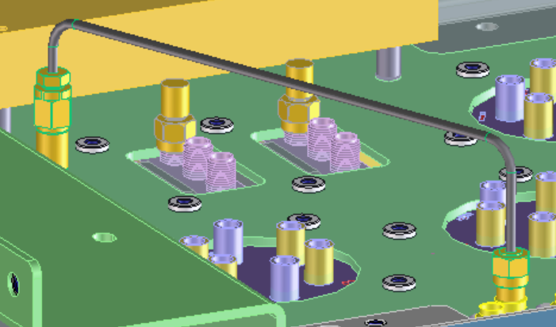
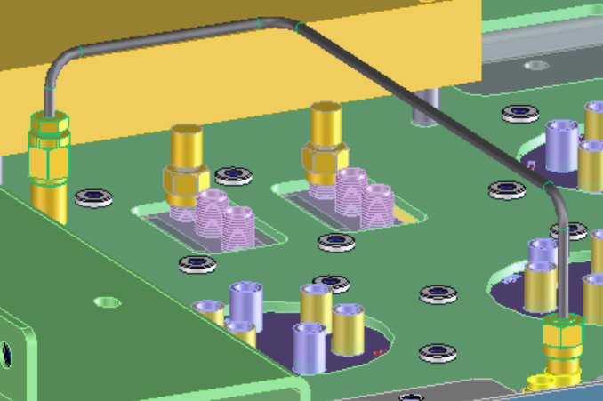
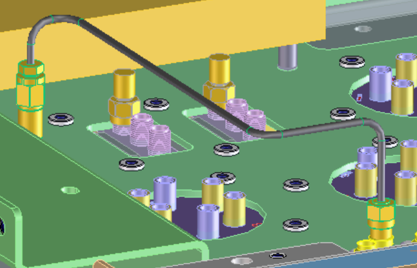

# Modeling Extension Module _[:MODULE-TITLE](:RCR :resource)_ {.title}{: .title}

This extension module provides automatic cable routing functionality for
the _Rigid Cable Advisor_.

Automatic routing is performed on one or more routing layers. If multiple layers
are provided the router picks the best layer based on smallest estimated
cable length and lowest number of bends required.

## Routing Components

>### Direct
>
> 
>
>The **Direct** component chooses the shortest (direct) connection between cable start and end.

>### U or V
>
> 
>
> The **U** or **V** components route the cable along isoparameter lines of the
> routing layer
>### U-V-U or V-U-V
>
> 

> The **U-V-U** or **V-U-V** components route the cable along two parallel
> isoparameter lines an connect them via a _step_"

# Getting Started

* 
* 
* 
