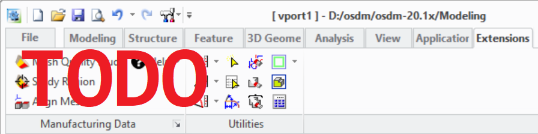

# The Extension Module User Interface {.title}{: .title}
    
The functionality of this extension module is accessible from the _Modeling_ user interface
in several locations. The most used dialogs of the extension module are accessible via a command group in
the **[:CADM-CMD-GROUP-TITLE](:rcr :resource)** tab of the
_Modeling_ ribbon bar.

{.leftfloat}{: .leftfloat}
    
1. TODO: Describe UI items
2. Help actions:
   * Display the doc documentation for the [:MODULE-TITLE](:rcr :resource)
   * Display general module information. See also 
3. [:summary]('RCR_SETTINGS :dialog)

Module help and management dialogs are available in following locations:

* _File -&gt; Settings -&gt; [:CADM-CMD-GROUP-TITLE](:rcr :resource) -&gt;_
  **[:SETTINGS-CMD-TITLE](:rcr :resource)**: The [:summary]('RCR_SETTINGS :dialog)
* _File -&gt;_ **Modules**_: Opens the _Modeling_ module management dialog where the extension module
  can be (de)activated in the [:EXTENSION-MODULES-PAGE-TITLE](:rcr :resource) tab by
  (de)selecting _[:MODULE-TITLE](:rcr :resource)_
* In the <b>&#x2754;</b> command group located at the right end of the _Modeling_ ribbon bar where
  the action _[:MODULE-TITLE](:rcr :resource)_ opens the module documentation in the browser.

